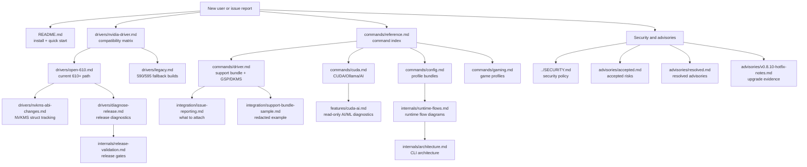
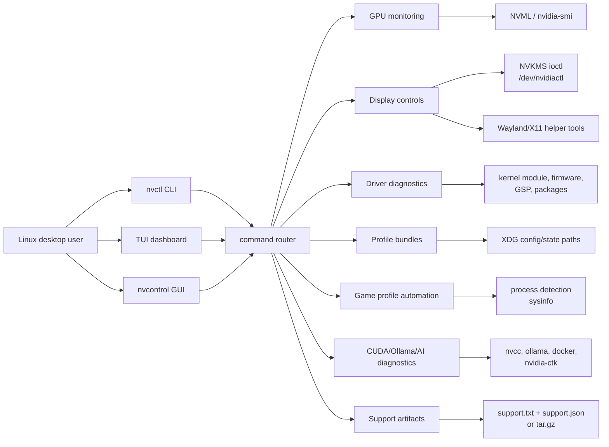
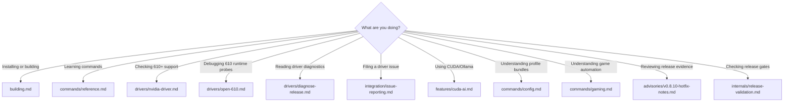

# nvcontrol Documentation

Complete documentation for nvcontrol - Modern NVIDIA Settings Manager for Linux + Wayland.

## Quick Start

**New Users:**
1. [README](../README.md) - Project overview and installation
2. [Building](building.md) - Build from source
3. [Commands](commands/reference.md) - Current CLI reference
4. [TUI Guide](tui-user-guide.md) - Terminal interface quickstart

Installer shortcut: `https://nv.cktech.sh` -> `https://raw.githubusercontent.com/GhostKellz/nvcontrol/main/release/install-system.sh`

Compatibility matrix: [drivers/nvidia-driver.md](drivers/nvidia-driver.md)

**RTX 50-series Users:**
- [RTX 5090 Setup](hardware/rtx-5090-setup.md) - Blackwell-specific setup

---

## Documentation Index



## Runtime Shape



## Common Paths



## Component Responsibilities

| Component | Primary docs | Responsibility |
|-----------|--------------|----------------|
| CLI and command router | [commands/reference.md](commands/reference.md), [commands.md](commands.md) | User-facing command surface, structured output, shell completion behavior |
| Driver diagnostics | [commands/driver.md](commands/driver.md), [drivers/diagnose-release.md](drivers/diagnose-release.md) | Kernel/userspace/GSP alignment, DKMS/source checks, release supportability |
| 610+ runtime probing | [drivers/open-610.md](drivers/open-610.md), [internals/runtime-flows.md](internals/runtime-flows.md) | Vulkan/EGL/kernel capability evidence for NVIDIA 610+ open-driver systems |
| Display controls | [features/vibrance.md](features/vibrance.md), [api/display.md](api/display.md) | Digital vibrance, display state, NVKMS-backed controls |
| Profile bundles | [commands/config.md](commands/config.md), [config/configuration.md](config/configuration.md) | Capture, import, preview, diff, apply, and rollback profile state |
| Game automation | [commands/gaming.md](commands/gaming.md) | Game detection, delayed profile application, systemd user-service lifecycle |
| CUDA/AI diagnostics | [commands/cuda.md](commands/cuda.md), [features/cuda-ai.md](features/cuda-ai.md) | Read-only CUDA, Ollama, container runtime, and workload-fit checks |
| Support artifacts | [integration/issue-reporting.md](integration/issue-reporting.md), [integration/support-bundle-sample.md](integration/support-bundle-sample.md) | Redacted support bundles and issue-reporting evidence |
| Release validation | [release-checklist.md](release-checklist.md), [internals/release-validation.md](internals/release-validation.md) | Release gates, hardware mutation boundaries, install/package evidence |
| Advisories | [advisories/accepted.md](advisories/accepted.md), [advisories/resolved.md](advisories/resolved.md) | Accepted dependency risk and resolved advisory history |

### Getting Started

| Document | Description |
|----------|-------------|
| [building.md](building.md) | Build from source, dependencies, feature flags |
| [commands/reference.md](commands/reference.md) | Foldered command reference |
| [commands.md](commands.md) | Legacy complete CLI reference |
| [tui-user-guide.md](tui-user-guide.md) | Terminal UI walkthrough |

### Features

GPU display and performance features.

| Document | Description |
|----------|-------------|
| [features/feature-guides.md](features/feature-guides.md) | Feature guide index |
| [features/vibrance.md](features/vibrance.md) | Digital vibrance (color saturation) |
| [features/hdr.md](features/hdr.md) | High Dynamic Range display |
| [features/vrr-gsync.md](features/vrr-gsync.md) | Variable Refresh Rate / G-SYNC |
| [features/image-sharpening.md](features/image-sharpening.md) | GPU post-processing |
| [features/overclocking.md](features/overclocking.md) | GPU/memory clock tuning |
| [features/cuda-ai.md](features/cuda-ai.md) | CUDA, Ollama, and local AI/ML diagnostics |

### Drivers

NVIDIA driver compatibility and optimization.

| Document | Description |
|----------|-------------|
| [drivers/driver-guides.md](drivers/driver-guides.md) | Driver guide index |
| [drivers/nvidia-driver.md](drivers/nvidia-driver.md) | nvcontrol version guidance by NVIDIA driver branch |
| [drivers/legacy.md](drivers/legacy.md) | Older-build notes for drivers 595 and earlier |
| [drivers/nvkms-abi-changes.md](drivers/nvkms-abi-changes.md) | NVKMS ABI break tracking across releases |
| [drivers/gsp.md](drivers/gsp.md) | GPU System Processor firmware |
| [drivers/diagnose-release.md](drivers/diagnose-release.md) | How to read release diagnostics |
| [drivers/dkms.md](drivers/dkms.md) | Dynamic Kernel Module Support |
| [drivers/open-610.md](drivers/open-610.md) | NVIDIA 610 open driver notes |
| [drivers/kernel-580.md](drivers/kernel-580.md) | Historical kernel driver 580+ notes |

### Hardware

GPU-specific setup guides.

| Document | Description |
|----------|-------------|
| [hardware/hardware-guides.md](hardware/hardware-guides.md) | Hardware guide index |
| [hardware/rtx-5090-setup.md](hardware/rtx-5090-setup.md) | RTX 5090 (Blackwell) setup |
| [hardware/asus-astral.md](hardware/asus-astral.md) | ASUS ROG Astral/Matrix features |
| [hardware/astral-owners.md](hardware/astral-owners.md) | ASUS Astral tips |
| [hardware/power-detection.md](hardware/power-detection.md) | Power connector detection |

### Commands

Detailed command documentation.

| Document | Description |
|----------|-------------|
| [commands/reference.md](commands/reference.md) | Command guide index |
| [commands/gpu.md](commands/gpu.md) | GPU info and monitoring |
| [commands/driver.md](commands/driver.md) | Driver info, GSP, DKMS, release diagnostics |
| [commands/power.md](commands/power.md) | Power management |
| [commands/overclock.md](commands/overclock.md) | Overclocking controls |
| [commands/gaming.md](commands/gaming.md) | Gaming profiles |
| [commands/config.md](commands/config.md) | Configuration management |
| [commands/container.md](commands/container.md) | Container GPU passthrough |
| [commands/cuda.md](commands/cuda.md) | CUDA, Ollama, and AI/ML commands |

### Internals

Architecture notes and data-flow diagrams.

| Document | Description |
|----------|-------------|
| [internals/architecture.md](internals/architecture.md) | CLI architecture and CUDA/AI diagnostic flow |
| [internals/runtime-flows.md](internals/runtime-flows.md) | Runtime control-plane, 610+ probing, profile, gaming, support, and TUI flows |
| [internals/release-validation.md](internals/release-validation.md) | Release validation gates and live 610+ smoke-test flow |

### API Reference

Rust library API documentation.

| Document | Description |
|----------|-------------|
| [api/reference.md](api/reference.md) | API reference index |
| [api/gpu.md](api/gpu.md) | GPU monitoring API |
| [api/power.md](api/power.md) | Power management API |
| [api/overclock.md](api/overclock.md) | Overclocking API |
| [api/fan.md](api/fan.md) | Fan control API |
| [api/display.md](api/display.md) | Display management API |
| [api/backend.md](api/backend.md) | Backend abstraction |

### Configuration

| Document | Description |
|----------|-------------|
| [config/configuration.md](config/configuration.md) | Configuration guide index |
| [config/backend-architecture.md](config/backend-architecture.md) | Backend design |
| [config/migration.md](config/migration.md) | Version upgrade guide |
| [config/session-persistence.md](config/session-persistence.md) | TUI state saving |

### Integration

| Document | Description |
|----------|-------------|
| [integration/integrations.md](integration/integrations.md) | Integration guide index |
| [integration/companion.md](integration/companion.md) | Lightweight desktop companion flow |
| [integration/issue-reporting.md](integration/issue-reporting.md) | Driver/GSP issue reporting workflow |
| [integration/support-bundle-sample.md](integration/support-bundle-sample.md) | Redacted support bundle example |
| [release-checklist.md](release-checklist.md) | Final release verification checklist |

### Security And Advisories

Security policy, accepted dependency risk, and resolved upgrade records.

| Document | Description |
|----------|-------------|
| [../SECURITY.md](../SECURITY.md) | Security policy and current audit posture |
| [advisories/accepted.md](advisories/accepted.md) | Accepted warnings or dependency risks for the active release |
| [advisories/resolved.md](advisories/resolved.md) | Dependency or code advisories resolved by release work |
| [advisories/v0.8.10-hotfix-notes.md](advisories/v0.8.10-hotfix-notes.md) | v0.8.10 hotfix scope, packaging updates, fan CLI fixes, and completion/manpage evidence |
| [advisories/v0.8.9-upgrade-notes.md](advisories/v0.8.9-upgrade-notes.md) | v0.8.9 dependency upgrades, runtime fixes, and verification evidence |

### Experimental

Prototype integrations and parked code live outside `docs/` in [`../experimental/README.md`](../experimental/README.md).

---

## GPU Support Matrix

| Architecture | Example GPUs | Status |
|--------------|--------------|--------|
| **Blackwell** | RTX 5060-5090 | Primary 610+ target; RTX 5090 path has local validation, broader tester coverage still wanted |
| **Ada Lovelace** | RTX 4060-4090 | Expected 610+ path; repeat live smoke coverage still wanted |
| **Ampere** | RTX 3060-3090 Ti | Expected 610+ path; repeat live smoke coverage still wanted |
| **Turing** | RTX 2060-2080 Ti | Supported where the loaded driver exposes the required NVML/display paths |
| **Pascal** | GTX 1060-1080 Ti | Basic/legacy support; use the driver compatibility matrix before assuming current-main behavior |

## Platform Support

**Linux Distributions** (Tier 1):
- Arch Linux (premier platform)
- Fedora 39+ / Nobara / Bazzite
- Debian 12+ / Ubuntu 22.04+ / Pop!_OS

**Display Servers:**
- Wayland (KDE, GNOME, Hyprland, Sway)
- X11 (full compatibility)

---

## Quick Examples

```bash
# GPU monitoring
nvctl gpu info
nvctl gpu stat
nvctl nvtop

# Digital vibrance
nvctl vibrance 150

# Overclocking
nvctl overclock apply --gpu-offset 150 --memory-offset 500

# Power management
nvctl power limit --percentage 90

# CUDA, Ollama, and AI/ML diagnostics
nvctl cuda doctor
nvctl cuda ollama
nvctl ai workloads
nvctl cuda env
nvctl cuda smoke --dry-run

# Create support bundle
nvctl doctor --support
```

---

## Resources

- [Contributing](../CONTRIBUTING.md) - Development guidelines
- [Changelog](../CHANGELOG.md) - Version history
- [GitHub Issues](https://github.com/ghostkellz/nvcontrol/issues)
