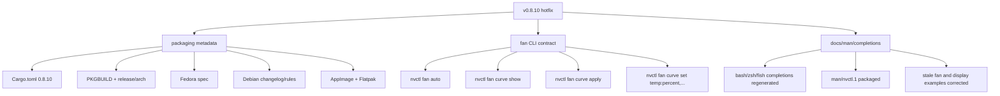
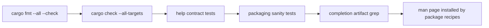

# v0.8.10 Hotfix Notes

`v0.8.10` is the hotfix over `v0.8.9`. It keeps the 610+ open-driver release scope, but closes release drift that was still visible after the dependency and documentation pass.



## Packaging Changes

| Surface | v0.8.10 Update |
|---------|----------------|
| Cargo | crate version already set to `0.8.10` |
| Root PKGBUILD | `pkgver=0.8.10`, man page install |
| Arch release PKGBUILD | `pkgver=0.8.10`, man page install |
| Fedora spec | `Version: 0.8.10`, changelog entry, man page in `%files` |
| Debian rules/changelog | `0.8.10-1` changelog entry and man page install |
| AppImage | `version: 0.8.10` |
| Flatpak | `tag: v0.8.10` |

## CLI Fixes

The fan command surface now matches the documentation and generated completions:

```bash
nvctl fan info
nvctl fan set 0 75
nvctl fan auto
nvctl fan curve show
nvctl fan curve apply balanced
nvctl fan curve apply aggressive --fan-id 0
nvctl fan curve set "30:20,60:50,75:80,85:100"
```

Profile application uses the current GPU temperature through NVML when available, then applies the selected curve through the existing fan backend. If temperature is unavailable, it falls back to the backend curve setter.

## Verification Targets


