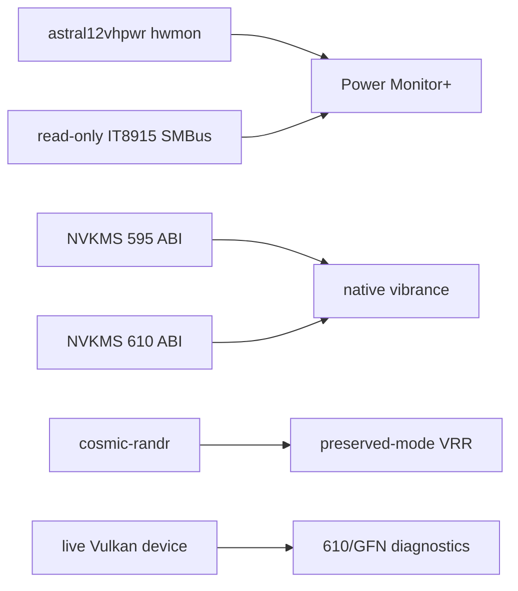

# v0.8.12 Release Notes

v0.8.12 is the NVIDIA 595/610 compatibility, corrected ASUS Astral telemetry,
COSMIC, and Linux gaming-integration release.

## Runtime scope

The Astral path now decodes measured big-endian millivolts and milliamps for all
six physical pins. Standard hwmon is preferred, with a native SMBus fallback.
Health rules are load-gated and informational; nvcontrol performs no automatic
shutdown or mitigation.

Native vibrance selects the known 595 or 610 `AllocDevice` size at runtime,
retries only the alternate known layout on `EPERM`, and reports live readback and
driver-advertised ranges. VRR output no longer invents G-SYNC, FreeSync, LFC, or
panel range claims when the compositor does not expose them.

## Hardware evidence

| Environment | Evidence |
|---|---|
| Arch, RTX 5090, open 610.57.04 | GUI/CLI/TUI, vibrance, VRR, Vulkan extensions, GFN detection, direct six-pin Astral telemetry |
| Fedora 44, RTX 3070, open 610.57.04 | build/tests, NVML, Vulkan/H.265, GFN, vibrance readback/no-change apply |
| Pop!_OS 24.04 COSMIC, RTX 3070, open 595.84 | 595 ABI selection, vibrance readback/no-change apply, preserved-mode COSMIC VRR, GFN |

## Packaging evidence

- v0.8.12 is synchronized across Cargo, both Arch recipes and `.SRCINFO`, Fedora,
  Debian, AppImage, and Flatpak.
- Arch, Debian, and Fedora package tests fail the build on test failures.
- Flatpak targets Freedesktop 25.08 and includes generated offline Cargo sources.
- Desktop metadata validates with one main application category.

See [the release checklist](../release-checklist.md) for the commands used before
tagging.
