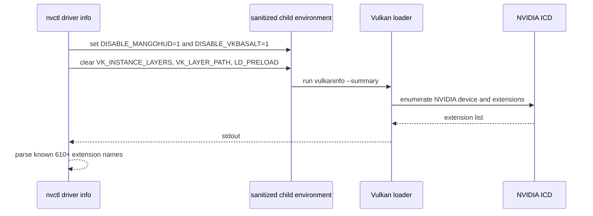
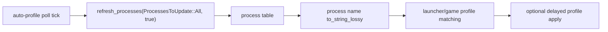

# v0.8.9 Upgrade Notes

`v0.8.9` is a dependency, diagnostics, CUDA/AI, documentation, and 610+ open-driver polish release. It keeps nvcontrol focused on Linux NVIDIA 610+ open-driver systems while preserving distro-realistic packaging floors where those ecosystems do not yet ship 610 as a hard dependency.

## Upgrade Map

```mermaid
flowchart TD
    release["v0.8.9 work"] --> deps["dependency upgrades"]
    release --> runtime["runtime fixes"]
    release --> docs["documentation and diagrams"]
    release --> ai["CUDA/Ollama/AI diagnostics"]
    release --> validation["release validation"]

    deps --> direct["Dependabot direct crate updates"]
    deps --> audit["cargo audit clean for RustSec advisories"]
    deps --> accepted["accepted non-advisory risk:\nserde_yaml deprecation"]

    runtime --> sysinfo["sysinfo 0.39 game detection migration"]
    runtime --> vulkan["overlay-safe Vulkan probe"]
    runtime --> driver["610.43.02 live driver smoke"]

    docs --> index["single docs/README.md index"]
    docs --> internals["runtime and release validation diagrams"]
    docs --> advisories["docs/advisories/*.md"]

    ai --> cuda["nvctl cuda doctor/info/env/smoke"]
    ai --> ollama["Ollama CUDA readiness"]
    ai --> support["support bundle CUDA/AI metadata"]

    validation --> checks["fmt, check, clippy, tests"]
    validation --> package["cargo package"]
    validation --> live["read-only 610+ live smoke"]
```

## Direct Rust Dependency Updates

| Crate | New Requirement | Notes |
|-------|-----------------|-------|
| `thiserror` | `2` | Error derive migration compiled without code changes. |
| `which` | `8` | Helper-tool discovery remains source-compatible. |
| `directories` | `6` | XDG path handling remains source-compatible. |
| `nvml-wrapper` | `0.12.1` | NVML monitoring and driver queries compile against the refreshed wrapper. |
| `toml` | `1.1` | Config parsing dependency refreshed. |
| `sysinfo` | `0.39` | Required code migration in game/process detection. |
| `notify` | `8.2` | File-watch dependency refreshed. |
| `dirs` | `6.0` | Legacy path helper refreshed. |
| `console` | `0.16` | Terminal output helper refreshed. |
| `nix` | `0.31` | Privilege/ioctl helper dependency refreshed. |

## Runtime Fixes

### Overlay-Safe Vulkan Probe

`nvctl driver info` uses `vulkaninfo --summary` as optional evidence for 610+ Vulkan extension detection. On the validated local system, the raw helper could crash through `libMangoHud.so`. nvcontrol now launches the helper with overlay-disabling environment variables and clears explicit layer/preload variables before parsing output.

### Game Detection Migration

`sysinfo` 0.39 changed process refresh and process-name handling. nvcontrol now refreshes all processes through the current API and converts process names through the lossless path expected by the crate.

## Validation Evidence

| Gate | Result |
|------|--------|
| `cargo check --all-targets` | Passed after dependency updates and code migration |
| `cargo clippy --all-targets -- -D warnings` | Passed |
| focused release tests | Passed for help contracts, CLI workflows, regressions, and packaging sanity |
| `cargo audit` | Passed with no RustSec vulnerabilities reported |
| `cargo package --allow-dirty --no-verify` | Passed |
| local 610+ live smoke | `nvctl driver info` succeeded on RTX 5090 with NVIDIA 610.43.02 |
| overlay-safe Vulkan helper | `vulkaninfo --summary` succeeded with overlay-disabling environment |

## Remaining Follow-Up

| Area | Follow-Up |
|------|-----------|
| YAML parser | Replace deprecated `serde_yaml` when compatibility work is scoped. |
| Flatpak cargo sources | Generate or restore `cargo-sources.json` before treating Flatpak packaging as fully release-ready. |
| Broader GPU coverage | Repeat read-only 610+ smoke checks on Ada, Ampere, and Turing systems. |
| Hardware mutation | Keep vibrance regression gated behind explicit opt-in; do not run it as a normal release check. |
