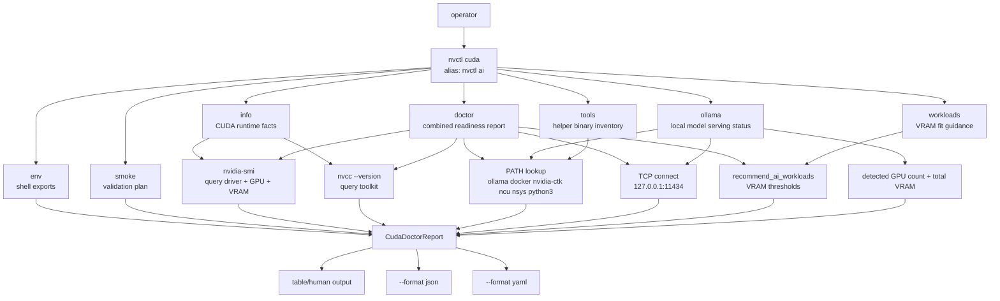

# CUDA And AI Commands

`nvctl cuda` is the read-only command surface for CUDA, Ollama, container GPU
runtime, and local AI/ML readiness. The same command group is available through the
shorter `nvctl ai` alias.

These commands are diagnostics and guidance only. They do not start services, run
containers, install packages, change display state, change vibrance, adjust clocks,
adjust fan curves, or write power limits.

## Command Topology



## Subcommands

| Command | Purpose | Mutates System |
|---------|---------|----------------|
| `nvctl cuda info` | Show driver version, CUDA toolkit version, toolkit path, and detected CUDA GPUs. | No |
| `nvctl cuda doctor` | Combine CUDA, helper tool, Ollama, container runtime, and workload-fit checks. | No |
| `nvctl cuda ollama` | Show native Ollama status, service reachability, GPU visibility, and GPU container command hints. | No |
| `nvctl cuda workloads` | Recommend local AI/ML workload fit from detected VRAM. | No |
| `nvctl cuda tools` | Show availability and version data for CUDA/AI helper tools. | No |
| `nvctl cuda env` | Emit shell exports for CUDA and Ollama workflows. | No |
| `nvctl cuda smoke --dry-run` | Print a native/container validation plan without executing it. | No |

## Quick Commands

```bash
nvctl cuda info
nvctl cuda doctor
nvctl cuda ollama
nvctl cuda workloads
nvctl cuda tools
nvctl cuda env
nvctl cuda smoke --dry-run

nvctl ai doctor --format json
nvctl ai workloads --format yaml
```

## `nvctl cuda info`

Use this when you need the raw CUDA view of the host:

```bash
nvctl cuda info
nvctl cuda info --format json
```

Reported fields:

| Field | Source |
|-------|--------|
| Driver version | `nvidia-smi --query-gpu=driver_version` |
| CUDA toolkit version | `nvcc --version` |
| Toolkit path | common CUDA install paths such as `/opt/cuda` and `/usr/local/cuda` |
| GPU list | `nvidia-smi --query-gpu=index,name,memory.total,memory.free` |
| Compute capability | local generation heuristic from GPU name |

## `nvctl cuda doctor`

Use this as the main AI/ML readiness check:

```bash
nvctl cuda doctor
nvctl cuda doctor --format json
```

The doctor report includes:

- CUDA runtime facts
- helper tool inventory
- Ollama CUDA status
- workload recommendations
- issue list
- suggested fixes

The JSON/YAML forms are intended for support bundles, CI smoke checks, and local
automation:

```bash
nvctl ai doctor --format json | jq '.ollama'
nvctl ai doctor --format yaml
```

## `nvctl cuda ollama`

Use this when Ollama is installed locally or you want to run the official GPU
container image.

```bash
nvctl cuda ollama
```

It checks:

- `ollama --version`
- whether `127.0.0.1:11434` is reachable
- detected NVIDIA GPU count and total VRAM
- Docker availability
- `nvidia-ctk` availability
- whether the local tool state is enough to configure/test GPU containers

It prints the native environment shape:

```text
CUDA_VISIBLE_DEVICES=0
OLLAMA_HOST=127.0.0.1:11434
OLLAMA_MODELS=~/.ollama/models
```

It also prints the GPU container command shape for manual review:

```bash
docker run -d --gpus=all -v ollama:/root/.ollama -p 11434:11434 --name ollama ollama/ollama
docker exec -it ollama ollama run llama3
```

`nvctl` does not execute those Docker commands.

## `nvctl cuda env`

Use this when you want shell-ready environment exports for native Ollama/CUDA
workflows:

```bash
nvctl cuda env
nvctl cuda env --format json
```

The human output is copyable shell syntax:

```bash
export CUDA_VISIBLE_DEVICES=0
export OLLAMA_HOST=127.0.0.1:11434
export OLLAMA_MODELS=~/.ollama/models
```

If a CUDA toolkit path is detected, `CUDA_HOME`, `PATH`, and `LD_LIBRARY_PATH`
exports are included as well.

## `nvctl cuda smoke`

Use this to print the commands that would validate native CUDA, native Ollama, and
GPU-container readiness:

```bash
nvctl cuda smoke --dry-run
nvctl cuda smoke --dry-run --format json
```

This command is intentionally dry-run only in `v0.8.10`. It prints commands such as
`nvidia-smi`, `nvcc --version`, `ollama list`, a CUDA container `nvidia-smi` smoke
test, and the official Ollama GPU container command shape. It does not execute them.

## `nvctl cuda workloads`

Use this for quick VRAM-fit guidance:

```bash
nvctl ai workloads
```

Current guidance buckets:

| Workload | Primary Signal |
|----------|----------------|
| Ollama 7B/8B quantized LLMs | good fit around 8 GiB+ VRAM |
| Ollama 13B/14B quantized LLMs | better fit around 14-16 GiB+ VRAM |
| Stable Diffusion / image generation | comfortable around 12 GiB+ VRAM |
| PyTorch/TensorFlow training | better fit around 16 GiB+ VRAM |

This is not a benchmark. Quantization, context size, batch size, model format, and
framework allocator behavior can materially change actual memory use.

## Failure Interpretation

| Symptom | Likely Meaning | Next Command |
|---------|----------------|--------------|
| Driver version is `Unknown` | `nvidia-smi` is installed but cannot query the driver, or the driver is unhealthy. | `nvctl driver diagnose-release` |
| CUDA toolkit is `Unknown` | `nvcc` is not installed or not on `PATH`; runtime-only inference may still work. | `nvctl cuda tools` |
| Ollama CLI found but service unreachable | Ollama is installed but not serving on localhost. | `ollama serve` or service status check |
| Docker found but `nvidia-ctk` missing | GPU containers are not ready. | install NVIDIA Container Toolkit |
| No GPU devices detected | CUDA inference cannot see a GPU from this process context. | `nvidia-smi` and `/dev/nvidia*` checks |

## Output Contract

`--format json` and `--format yaml` serialize the same data model used by the human
output. The JSON top-level keys for `doctor` are:

```text
cuda
tools
ollama
ai_recommendations
issues
fixes
```

Keep scripts pinned to keys, not human wording.

## Support Bundle Integration

`nvctl driver support-bundle` and `nvctl doctor --support` include CUDA/AI
diagnostics in both the text report and JSON metadata under
`cuda_ai_diagnostics`. This gives issue reports the local CUDA toolkit, Ollama,
Docker, NVIDIA Container Toolkit, GPU visibility, and workload-fit context without
requiring a second round trip.
