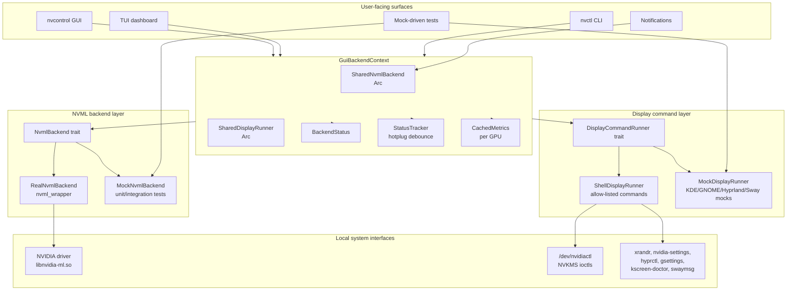
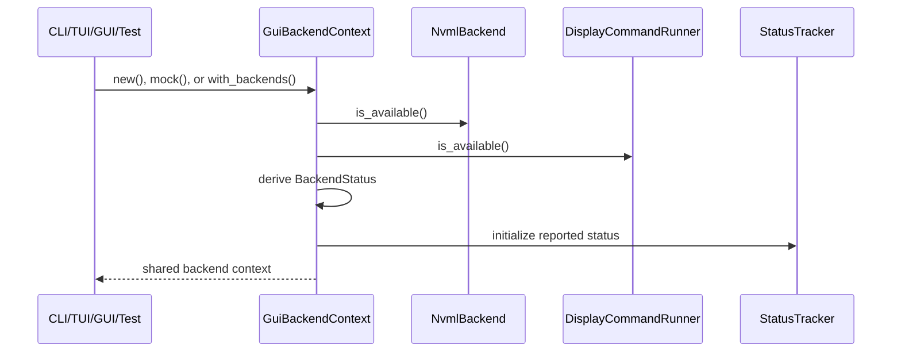
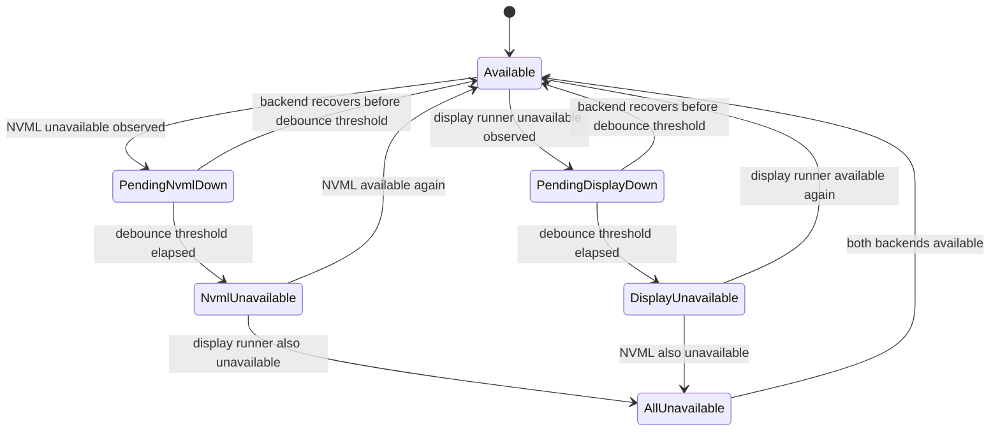
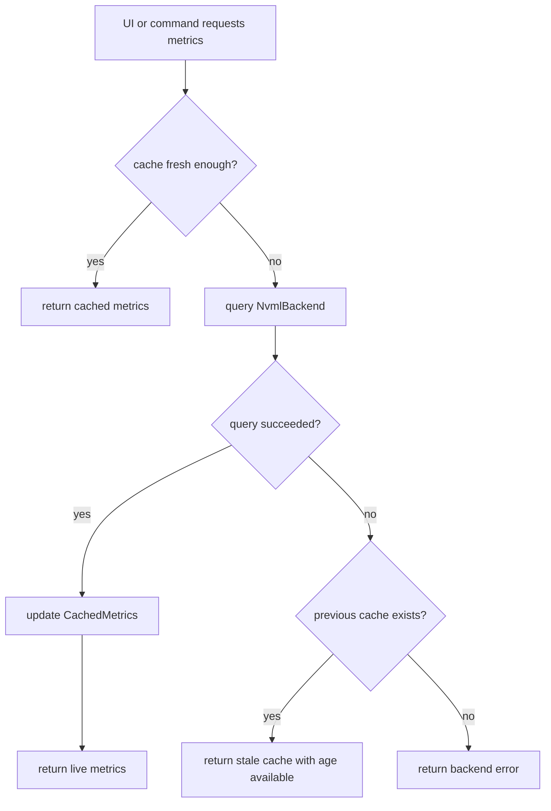
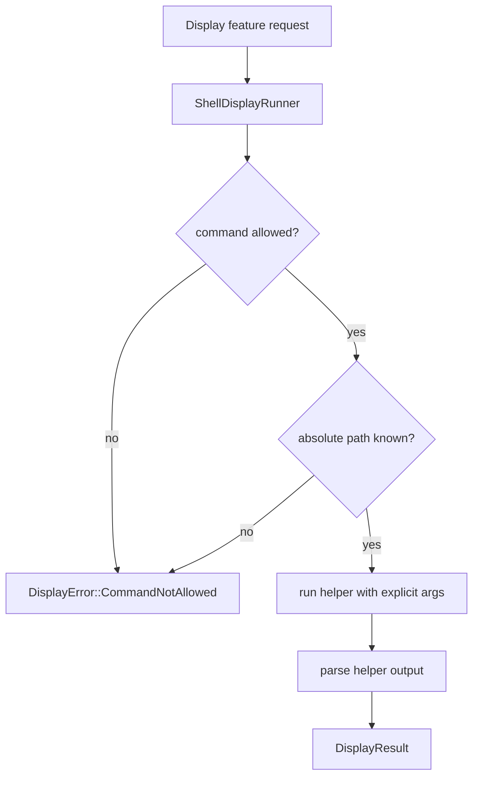
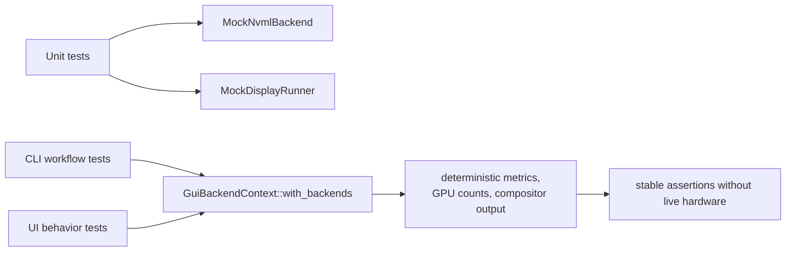

# Backend Architecture

nvcontrol uses a backend abstraction layer so the CLI, TUI, GUI, diagnostics, and tests can share the same GPU and display access model without opening duplicate driver sessions or shelling out through unreviewed command paths.

## Architecture Map

## Component Responsibilities

| Component | Primary type | Responsibility |
|-----------|--------------|----------------|
| Shared NVML backend | `SharedNvmlBackend` | Shared `Arc<dyn NvmlBackend>` used by GPU, monitoring, fan, power, notifications, multi-GPU, and UI paths |
| Real NVML backend | `RealNvmlBackend` | Production NVML access through `nvml-wrapper` |
| Mock NVML backend | `MockNvmlBackend` | Deterministic GPU metrics, device counts, and error states for tests |
| Shared display runner | `SharedDisplayRunner` | Shared `Arc<dyn DisplayCommandRunner>` for display helper commands |
| Shell display runner | `ShellDisplayRunner` | Production runner that only executes allow-listed display helper binaries |
| Mock display runner | `MockDisplayRunner` | Deterministic compositor/display command responses for tests |
| Backend context | `GuiBackendContext` | Combines NVML, display runner, device count, driver version, status, cache, and status debounce |
| Status tracker | `StatusTracker` | Debounces backend availability changes so UI layers do not flicker during hotplug events |
| Metrics cache | `CachedMetrics` | Keeps the latest successful GPU metrics and lets UI code detect stale values |

## Backend Creation Flow

Production callers use `GuiBackendContext::new()` or the shared backend constructors. Tests use `GuiBackendContext::mock()` or `GuiBackendContext::with_backends(...)` so they can exercise UI and command behavior without live NVIDIA hardware.

## Runtime Status Model

`BackendStatus` is intentionally coarse:

| Status | Meaning |
|--------|---------|
| `Available` | NVML and display command runner are available |
| `NvmlUnavailable(String)` | Display path is available, but NVML is unavailable |
| `DisplayUnavailable(String)` | NVML is available, but the display command runner is unavailable |
| `AllUnavailable { ... }` | Neither backend path is currently available |

## Metrics Cache Flow

The cache keeps dashboards usable when a single NVML read fails, while still allowing stale-data checks through the cache age helpers.

## Display Command Security Model

`ShellDisplayRunner` is not a generic shell wrapper. It is constrained to reviewed helper binaries such as `xrandr`, `nvidia-settings`, `hyprctl`, `gsettings`, `kscreen-doctor`, and `swaymsg`. Commands outside the allow-list are rejected before execution.

## Test Strategy

Mock backends cover:

- single-GPU, multi-GPU, and no-GPU NVML states
- deterministic temperatures, fan speeds, power usage, utilization, clocks, and memory values
- compositor-specific display command responses
- unavailable backend states for status and fallback testing

## Current Module Usage

| Module | Backend path |
|--------|--------------|
| `gpu.rs` | `SharedNvmlBackend` |
| `monitoring.rs` | `SharedNvmlBackend` |
| `multi_gpu.rs` | `SharedNvmlBackend` |
| `fan.rs` | `SharedNvmlBackend` |
| `advanced_power.rs` | `SharedNvmlBackend` |
| `interactive_cli.rs` | `SharedNvmlBackend` |
| `notifications.rs` | `SharedNvmlBackend` |
| `tui/mod.rs` | `GuiBackendContext` |
| `display_backend.rs` | `SharedDisplayRunner` and `ShellDisplayRunner` |
| `vrr.rs`, `hdr.rs`, display feature paths | `SharedDisplayRunner` where display helpers are required |

## Operational Boundaries

- Backend docs should describe the current architecture rather than pinning historical release numbers.
- Production backend paths should remain explicit about which local APIs they touch.
- Test examples should use mock backends instead of requiring live NVIDIA hardware.
- Display command execution should stay allow-listed and argument-based.
- UI refresh code should treat temporary backend loss as a debounced state change, not an immediate hard failure.
