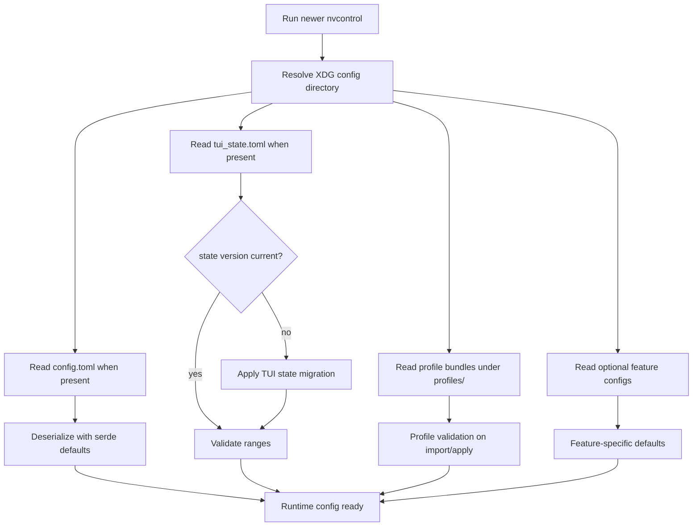
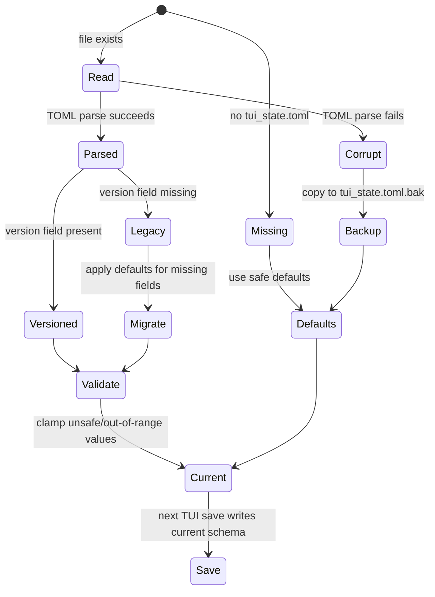
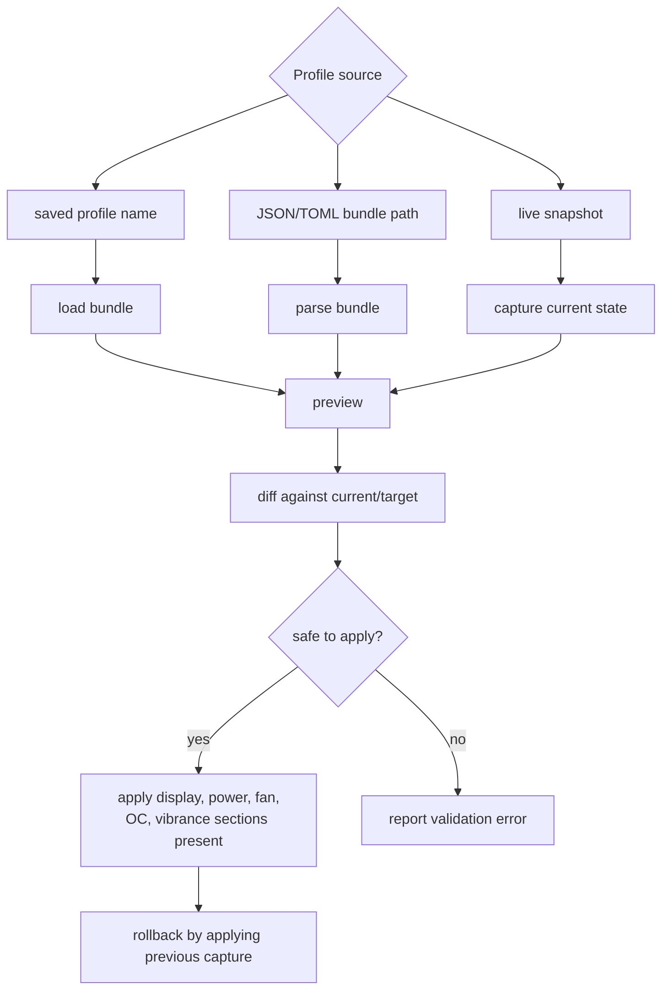
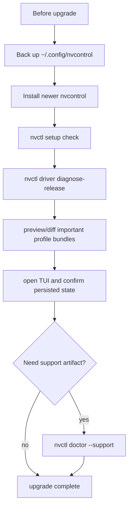

# Migration Guide

This guide documents how nvcontrol handles configuration and state across upgrades. It focuses on current upgrade behavior, validation, backup paths, and rollback steps instead of pinning the page to one historical release.

## Migration Scope



## Files And Ownership

nvcontrol keeps user-owned state under the XDG configuration directory.

| Path | Owner | Migration Behavior |
|------|-------|--------------------|
| `~/.config/nvcontrol/config.toml` | User preferences | Preserved; missing fields fall back to serde defaults |
| `~/.config/nvcontrol/tui_state.toml` | TUI session state | Versioned; older or missing fields are migrated and validated |
| `~/.config/nvcontrol/profiles/*.json` | Profile bundles | Parsed when listed/imported/applied; safety validation runs before apply unless explicitly skipped |
| `~/.config/nvcontrol/power_management.toml` | Power profiles and schedules | Loaded by power-management flows; missing file uses defaults |
| `~/.config/nvcontrol/game_profile_auto.toml` | Auto-profile service settings | Loaded by gaming auto commands; missing file uses defaults |

## TUI State Migration

`tui_state.toml` carries an internal schema version. The current schema stores the last selected GPU, active tab, fan curve points, overclock offsets, power limit percentage, and selected OC preset.



### Validation Rules

| Field | Valid Range | Out-of-range Behavior |
|-------|-------------|----------------------|
| `power_limit_percent` | 50-150 | Values below range clamp to 50; values above range reset to 100 |
| `gpu_offset` | -500 to +500 MHz | Reset to 0 |
| `memory_offset` | -1000 to +2000 MHz | Reset to 0 |
| `current_tab` | 0-10 | Reset to 0 |
| `selected_gpu` | 0-16 | Reset to 0 |
| `fan_curve_points` | temperature and percentage 0-100 | Values above 100 clamp to 100 |

## Profile Bundle Migration

Profile bundles are not silently rewritten during startup. They are interpreted when a command asks to import, preview, diff, or apply them.



Before applying an old or third-party bundle, capture the current state:

```bash
nvctl config capture --name before-upgrade
nvctl config preview --input ./profile.json
nvctl config diff --current live --target ./profile.json
```

## Upgrade Checklist



Recommended backup:

```bash
cp -a ~/.config/nvcontrol ~/.config/nvcontrol.backup
```

Recommended post-upgrade checks:

```bash
nvctl setup check
nvctl driver diagnose-release
nvctl config preview --input live
nvctl config profiles
```

## Rollback And Recovery

| Problem | Recovery |
|---------|----------|
| TUI opens on the wrong tab or GPU | Remove `~/.config/nvcontrol/tui_state.toml` and restart the TUI |
| TUI state parse error | Use the generated `tui_state.toml.bak` file for inspection, then remove the corrupt state file |
| Imported profile behaves incorrectly | Apply the pre-upgrade capture or restore the profile from backup |
| Config behavior is unclear after upgrade | Move `config.toml` aside and let nvcontrol recreate defaults |
| Need a clean reset | Move the whole config directory aside instead of deleting it immediately |

Reset commands:

```bash
mv ~/.config/nvcontrol/tui_state.toml ~/.config/nvcontrol/tui_state.toml.disabled
mv ~/.config/nvcontrol/config.toml ~/.config/nvcontrol/config.toml.disabled
mv ~/.config/nvcontrol ~/.config/nvcontrol.disabled
```

## Release-Specific Notes

Current release notes and security/dependency upgrade records live in:

- [../advisories/v0.8.10-hotfix-notes.md](../advisories/v0.8.10-hotfix-notes.md)
- [../advisories/v0.8.9-upgrade-notes.md](../advisories/v0.8.9-upgrade-notes.md)
- [../../CHANGELOG.md](../../CHANGELOG.md)
- [../../SECURITY.md](../../SECURITY.md)

Keep this page focused on durable migration behavior. Put one-release dependency, audit, and live-driver evidence in the advisory notes instead.
