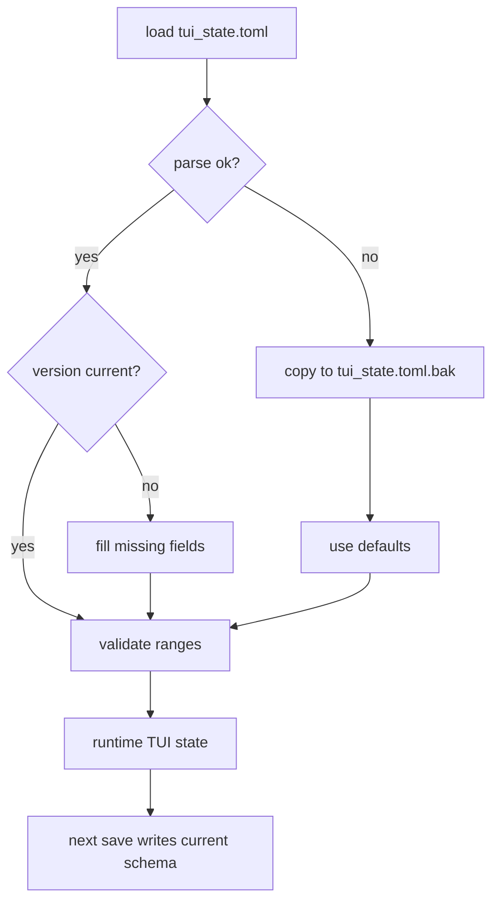

# TUI Session Persistence

The TUI now saves your session state automatically, so your settings survive restarts.

## What's Saved

| Setting | Description |
|---------|-------------|
| `selected_gpu` | Last selected GPU index (multi-GPU systems) |
| `current_tab` | Last active tab (Dashboard, Memory, Processes, etc.) |
| `fan_curve_points` | Custom fan curve temperature/speed pairs |
| `gpu_offset` | GPU clock offset in MHz |
| `memory_offset` | Memory clock offset in MHz |
| `power_limit_percent` | Power limit percentage (50-150%) |
| `oc_preset` | OC preset name (Stock, MildOc, Performance, Extreme) |

## File Location

```
~/.config/nvcontrol/tui_state.toml
```

## Example File

```toml
version = 1
selected_gpu = 0
current_tab = 0
fan_curve_points = [[40, 30], [60, 50], [80, 80], [90, 100]]
gpu_offset = 100
memory_offset = 500
power_limit_percent = 95
oc_preset = "Performance"
```

## Schema Migration

The `version` field tracks the TUI state schema. Missing fields get defaults, old or incomplete state is validated, and corrupt state is backed up before nvcontrol falls back to defaults.



### Upgrade Behavior

When loading older or incomplete state:
- Missing fields get safe defaults
- Values are validated and clamped to safe ranges
- Corrupt files are backed up to `*.toml.bak` before reset

### Value Validation

On load, values are clamped to safe ranges:

| Field | Valid Range | Out-of-range Behavior |
|-------|-------------|----------------------|
| `power_limit_percent` | 50-150 | Clamped or reset to 100 |
| `gpu_offset` | -500 to +500 MHz | Reset to 0 |
| `memory_offset` | -1000 to +2000 MHz | Reset to 0 |
| `current_tab` | 0-10 | Reset to 0 |
| `selected_gpu` | 0-16 | Reset to 0 |
| `fan_curve_points` | 0-100 each | Clamped to 100 |

## Disabling Persistence

To start fresh each time, delete the state file:

```bash
rm ~/.config/nvcontrol/tui_state.toml
```

Or create an empty file to prevent saving:

```bash
touch ~/.config/nvcontrol/tui_state.toml
chmod 000 ~/.config/nvcontrol/tui_state.toml
```

## Troubleshooting

### Settings Not Saving

1. Check directory permissions:
   ```bash
   ls -la ~/.config/nvcontrol/
   ```

2. Verify disk space:
   ```bash
   df -h ~/.config
   ```

3. Check for errors in TUI output on exit

### Corrupt State File

If the TUI fails to start or behaves unexpectedly:

```bash
# Backup and reset
mv ~/.config/nvcontrol/tui_state.toml ~/.config/nvcontrol/tui_state.toml.backup
```

The TUI will create a fresh state file on next run.
