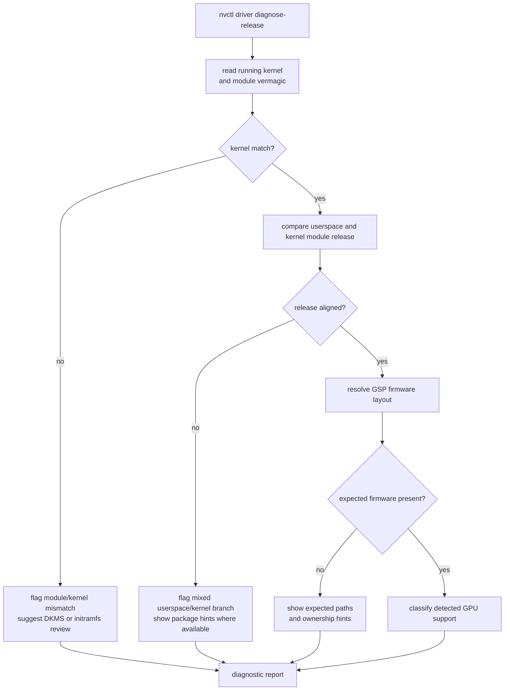

# Interpreting `diagnose-release`

`nvctl driver diagnose-release` is the quickest way to inspect kernel/userspace/GSP alignment on Linux NVIDIA systems.

## Diagnostic Decision Tree

## Fields

### `Running Kernel`

The currently booted kernel reported by `uname -r`.

### `Module Kernel`

The kernel release the loaded NVIDIA module was built for, derived from `modinfo nvidia -F vermagic`.

If this differs from `Running Kernel`, the driver stack is likely not aligned with the current booted kernel.

### `Kernel Match`

Simple yes/no summary of whether `Running Kernel` and `Module Kernel` match.

### `Userspace`

The userspace NVIDIA driver release detected from the active stack.

### `Kernel Module`

The kernel-side NVIDIA module release when available.

### `Release Match`

High-level release alignment summary.

Typical values:

- `aligned at ...`
- `mismatch: kernel module ... vs userspace ...`
- `structurally aligned ...`

### `FW Layout`

How firmware was found on disk.

Typical values:

- `per-chip`
- `legacy-versioned`

### `FW Path`

The expected firmware directory resolved for the current GPU/driver combination.

### `FW File`

The actual firmware file found inside the resolved path, when available.

### `Expected Paths`

Paths nvcontrol expects to exist for the current GPU architecture and/or driver version.

These are useful when a package install is incomplete or mixed across branches.

### `GPU Support`

Per-GPU support summary including:

- detected GPU name
- PCI location/device id when available
- chip code hint
- architecture classification
- whether the GPU is considered open-driver capable

### `Ownership Checks`

Arch-specific package ownership and lightweight verification for expected firmware paths.

Useful for catching:

- missing firmware package ownership
- unexpected package owner for firmware files
- partially upgraded package sets

### `Arch Packages`

Quick package presence/version view for common NVIDIA stack packages.

## Common Patterns

### Healthy open-driver state

- `Kernel Match: yes`
- `Release Match: aligned at ...`
- `FW Layout: per-chip`
- expected firmware paths present

### Kernel mismatch after update

- `Kernel Match: no`
- module kernel older than running kernel
- DKMS rebuild likely required

### Mixed userspace/kernel state

- `Release Match: mismatch ...`
- package versions may differ across `nvidia-open`, `nvidia-utils`, or firmware ownership

### Missing firmware path

- expected path reported as missing
- ownership checks may show no package owner
- often indicates incomplete install or branch switch leftovers
