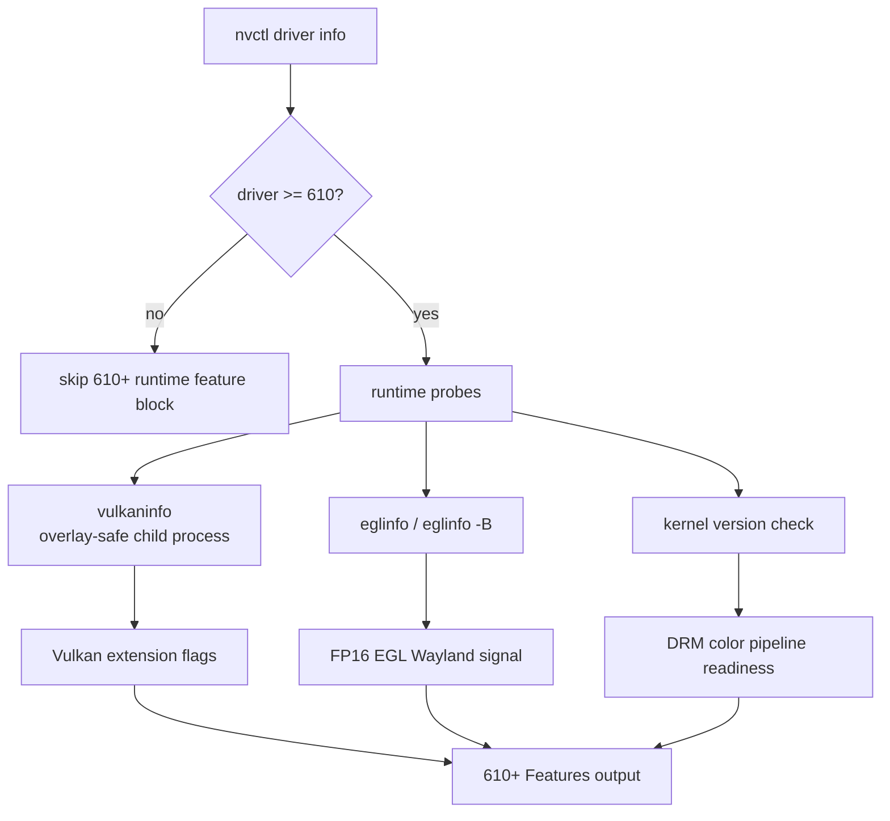

# NVIDIA 610 Driver Analysis

> **Validated Driver Version:** 610.57.04
> **Kernel Modules:** open-gpu-kernel-modules 610.57.04
> **Minimum Kernel:** 6.6+ (7.0+ recommended)

## Overview

The 610 feature branch introduces new Vulkan extensions, FP16 EGL framebuffer support on Wayland, DMABUF mmap for discrete GPUs, and DRM color pipeline support (kernel 6.19+). The initial 610 build also included an NVKMS ABI break that required nvcontrol updates. The later 610.57.04 build is primarily a bug-fix update; it does not require another nvcontrol NVKMS layout change on the validated RTX 5090 system.

For the full nvcontrol version matrix across 590, 595, and 610, see [nvidia-driver.md](nvidia-driver.md).

## Driver Requirements

| Requirement | 610 Series | Previous (595) |
|-------------|------------|----------------|
| Wayland | 1.20+ | 1.20+ |
| glibc | 2.27+ | 2.27+ |
| X.Org Server | 1.17+ (ABI 19) | 1.17+ |
| Kernel | 4.15+ (6.6+ recommended) | 4.15+ |
| Kernel Modules | Open only | Open only |

## Key Changes in 610.43.02

### NVKMS ABI Break

The `NvKmsAllocDeviceReply` struct size changed from **888 bytes** (595) to **816 bytes** (610) — a 72-byte reduction. This is a silent ABI break: the kernel validates `paramSize` on every ioctl and returns `EPERM` when the size doesn't match, which looks like a permissions error but is actually a struct mismatch.

**Impact on nvcontrol:** The padding in `src/nvkms_bindings.rs` was updated from 888 to 816 bytes. Without this fix, all NVKMS ioctls (vibrance, display detection) fail with `EPERM`.

**Verification method:**
```c
// Compile against 610 headers to verify struct sizes
#include "nvidia-modeset/nvkms-api-types.h"
#include "nvidia-modeset/nvkms-api.h"
printf("NvKmsAllocDeviceReply: %zu\n", sizeof(struct NvKmsAllocDeviceReply));
// Expected: 816
```

### New Vulkan Extensions

| Extension | Purpose |
|-----------|---------|
| `VK_KHR_device_group_creation` | Logical devices from multiple physical devices |
| `VK_EXT_shader_long_vector` | Extended vector types in shaders |
| `VK_KHR_internally_synchronized_queues` | Driver-managed queue synchronization |
| `VK_NV_push_constant_bank` | Extended push constant storage |

nvcontrol detects these at runtime via full `vulkaninfo` output in the `detect_vulkan_extensions()` helper. Device extensions are not reliably present in `vulkaninfo --summary`. The helper is launched through an overlay-safe command path that disables MangoHud/vkBasalt environment toggles and clears explicit Vulkan layer/preload variables before spawning `vulkaninfo`; this keeps a broken implicit overlay from crashing the diagnostic path.



### FP16 EGL on Wayland

Driver 610+ adds `EGL_EXT_pixel_format_float` support, enabling 16-bit floating-point framebuffer configs on Wayland compositors. This improves HDR and wide-gamut color rendering.

nvcontrol detects this via `eglinfo` output and surfaces it in:
- `nvctl driver info` (610+ Features section)
- `nvctl wayland status` (Capabilities section)

### DMABUF mmap for Discrete GPUs

Support for `mmap()` on DMA-BUF file descriptors exported from discrete NVIDIA GPUs. Previously only available on integrated GPUs.

### DRM Color Pipeline (Kernel 6.19+)

Per-plane DRM color pipeline support in the `nvidia-drm` kernel module requires
driver 610+, kernel 6.19+, and DRM KMS enabled. nvcontrol reports the driver,
kernel, and live modeset state separately; capability does not prove that a
color pipeline is active on a plane.

### Multiplanar YCbCr DRM Format Modifiers

Support for DRM format modifiers on multiplanar YCbCr formats, improving video decode and display pipeline efficiency.

## 610.57.04 Update

NVIDIA's changelog describes 610.57.04 as fixes over the first 610 build,
including Vulkan/game stability fixes involving descriptor-heap workloads,
device-group display enumeration, suspend/resume, DKMS builds and display paths.
The installed open-kernel-module source has no `12VHPWR`, `IT8915` or hwmon
implementation, so there is no new NVIDIA connector-power API for nvcontrol to
switch to.

`VK_EXT_descriptor_heap` predates 610, but 610.57.04 contains relevant fixes for
games using that path. nvcontrol detects the device extension from the live
Vulkan implementation. It does not set `VKD3D_CONFIG=descriptor_heap` globally:
extension exposure and per-title VKD3D-Proton readiness are separate questions.

`nvidia_drm.modeset=1` has been the driver default since the 595 series.
Diagnostics therefore warn only when the boot command line explicitly disables
modesetting; absence of the old opt-in argument is not a problem.

CDMM in the 610 data-center notes applies to coherent GB200 platforms. It is not
a GeForce RTX 5090 tuning feature and nvcontrol does not recommend enabling it.

## Linux NVIDIA Applications

The native Linux application that left beta is **GeForce NOW**, NVIDIA's cloud
gaming client, not the Windows NVIDIA App control panel. It supports Ubuntu
24.04 and later and is distributed through NVIDIA's Flatpak repository. nvcontrol
reports whether Flatpak app ID `com.nvidia.geforcenow` is installed, but its
absence is never a warning and nvcontrol does not install it.

## nvcontrol Compatibility

### Changes Required for 610

| Component | Change | File |
|-----------|--------|------|
| NVKMS bindings | AllocDeviceReply padding 888→816 | `src/nvkms_bindings.rs` |
| Driver capabilities | Added 4 new 610+ flags | `src/drivers.rs` |
| Runtime detection | Vulkan, EGL, kernel version helpers | `src/drivers.rs` |
| Wayland integration | FP16 EGL capability field | `src/wayland_integration.rs` |
| CLI output | 610+ features section in `driver info` | `src/drivers.rs` |

### Capability Flags Added

```rust
// DriverCapabilities (610+ gating)
pub has_vulkan_device_group: bool,
pub has_fp16_egl_wayland: bool,
pub has_dmabuf_mmap: bool,
pub has_drm_color_pipeline: bool,
pub has_vulkan_descriptor_heap: bool, // runtime probe, not version inference
```

## Testing Checklist

- [x] `nvctl vibrance 200` — sets vibrance on all displays
- [x] `nvctl vibrance 100` — resets vibrance
- [x] `nvctl driver info` — shows 610+ features section
- [x] `nvctl wayland status` — shows FP16 EGL capability
- [x] complete all-feature Rust test suite
- [x] NVKMS 610 layout verified against local 610.57.04 open-module headers and live hardware
- [x] overlay-safe full `vulkaninfo` device-extension probe
- [x] corrected IT8915 telemetry live-read on RTX 5090 / 610.57.04
- [x] existing native digital vibrance path remains functional on 610.57.04
- [ ] `eglinfo` — verify FP16 EGL detection on live system

## Hardware Validation Notes

| GPU Family | 610+ Open Driver Status | nvcontrol Status |
|------------|--------------------------|------------------|
| RTX 50 / Blackwell | Primary target, needs broader tester coverage | RTX 5090 validated on open 610.57.04 |
| RTX 40 / Ada | Expected supported path | Needs repeat smoke tests for vibrance, VRR, support bundle, and setup check |
| RTX 30 / Ampere | Supported 610 path | RTX 3070 validated on Fedora/open 610.57.04 |
| Driver 595 | Regression path | RTX 3070 validated on Pop!_OS/open 595.84 with runtime ABI selection |
| Driver 590 and earlier | Use compatibility matrix | Use the documented older vibrance-compatible release |

## References

- [open-gpu-kernel-modules 610.57.04](https://github.com/NVIDIA/open-gpu-kernel-modules/releases/tag/610.57.04)
- [NVIDIA 610.57.04 data-center release notes](https://docs.nvidia.com/datacenter/tesla/tesla-release-notes-610-57-04/index.html)
- [NVIDIA: GeForce NOW native Linux app exits beta](https://blogs.nvidia.com/blog/geforce-now-thursday-linux-native-app/)
- [NVKMS ABI Changes](nvkms-abi-changes.md)

---

## Changelog

| Date | Change |
|------|--------|
| 2026-08-16 | Validated 610.57.04, corrected runtime Vulkan probing, documented descriptor heap and GeForce NOW boundaries |
| 2026-06-23 | Added v0.8.10 setup/support-bundle validation notes and local 610.43.02 source verification reference |
| 2026-05-26 | Initial analysis of 610.43.02 — NVKMS ABI fix, capability flags, runtime detection |
