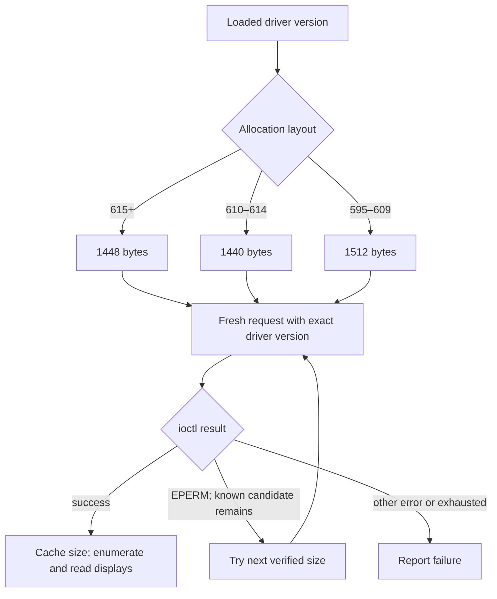

# NVIDIA 615 support

The support release adds the driver's allocation ABI to native digital vibrance
and reports its new capabilities through existing driver diagnostics. It retains
the earlier allocation paths; see the [compatibility matrix](nvidia-driver.md).


The driver also removes `NVKMS_IOCTL_CHECK_LUT_NOTIFIER`. Commands after that
entry shift down by one: set/get/valid-values display attributes use 21/22/23,
while the retained branches use 22/23/24. The ioctl dispatch helper selects the
command map from the loaded module independently of allocation-size fallback.
The removed command is rejected instead of accidentally dispatching its successor.

## Native vibrance

The allocation request is 1448 bytes, including an 824-byte reply. The request
fields and the reply offsets read by nvcontrol match the earlier supported
layouts. The controller prefers the loaded branch's size, retries only known
sizes on `EPERM`, and caches a successful size for that process.



The backing buffer accommodates every known candidate. The
[ABI record](nvkms-abi-changes.md) contains independently measured sizes and
field offsets. This fixes the allocation failure without changing permissions.

```bash
nvctl display vibrance get
nvctl display vibrance list
nvctl vibrance 150
```

The last command deliberately changes connected displays. Read and preserve your
existing values when testing; use per-display controls if they differ.

## New driver features

| Feature | nvcontrol behavior |
|---|---|
| `VK_NV_low_latency` revision 2 | Checks the advertised revision. NVIDIA provides driver-side support for Reflex in Vulkan-native Proton games using `NvLowLatencyVk.dll`. The game must support Reflex. |
| `VK_NV_low_latency2` | Lists the extension when detected. The driver includes Wayland/display-surface latency fixes. |
| `VK_EXT_cluster_acceleration_structure` | Reports runtime detection; release-note support alone does not establish availability on a particular system. |
| Cgroups GPU memory partitioning | Reports driver support. Requires compatible kernel/controller configuration; no quotas are changed automatically. |
| 12 bpc color reporting | Reports the driver's expanded reporting capability, not an assertion that a monitor is currently using 12 bpc. |
| Kernel suspend notifiers | Reads the effective loaded setting from `/proc/driver/nvidia/params`. |
| `RmDisableDisplayGlitchPerfLimit` | Reports availability of the opt-in registry override. It may reduce multi-monitor idle power while causing momentary display glitches; it is not enabled automatically. |
| Smooth Motion and Vulkan fixes | Delivered by the matching driver libraries; no nvcontrol-specific toggle is needed for the fixes. |

The initial live RTX 5090 probe advertised low-latency revision 2, but did not
advertise cluster acceleration. Capability output preserves that distinction.
Do not force Vulkan environment variables to claim a missing extension.

```bash
nvctl driver info
nvctl driver capabilities
nvctl driver diagnose-release
nvctl driver validate --driver 615
```

Driver changes and defaults are documented by the matching NVIDIA runfile's
`NVIDIA_Changelog` and `README.txt`; the ABI source is
[NVIDIA's tagged NVKMS header](https://github.com/NVIDIA/open-gpu-kernel-modules/blob/615.71.09/src/nvidia-modeset/interface/nvkms-api.h).
The older [610 notes](open-610.md) remain available for regression coverage.

## Validation

See the [release evidence](../advisories/v0.8.13-release-notes.md). Hardware
validation on the current driver does not replace regression testing on older
physical or virtual machines.

## Proton Reflex

The new path requires a Vulkan-native Windows game using `NvLowLatencyVk.dll`,
a compatible Proton runtime, and the advertised low-latency extension revision.
Enable Reflex in the game's own settings. nvcontrol reports the driver API and
Proton path separately from in-game state, which it cannot currently observe.
An unavailable probe is not proof that every possible Reflex integration is
unsupported. Older Proton/DXVK/VKD3D integrations have their own requirements.

The driver's Wayland low-latency, Smooth Motion startup/Alt-Tab, and Vulkan
loader file-descriptor fixes arrive with its matching libraries. nvcontrol does
not patch Proton or enable Reflex globally. It does not measure end-to-end input
latency; the GUI reports that measurement as unavailable.
