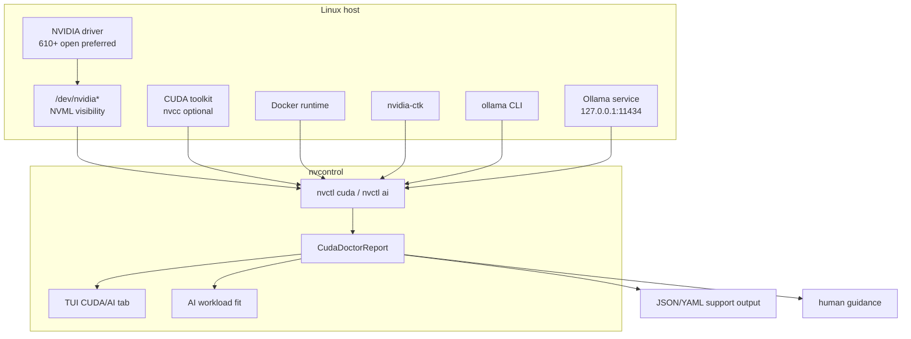
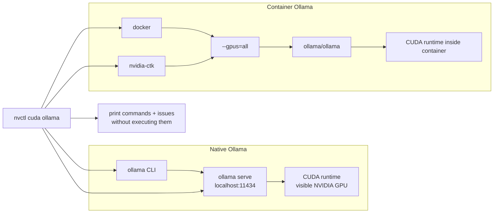
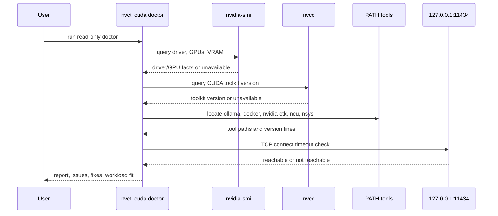
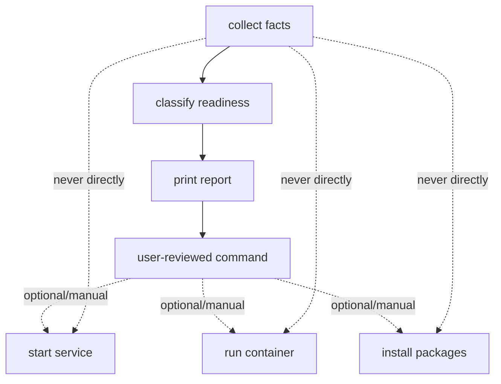

# CUDA, Ollama, And Local AI/ML

The CUDA/AI feature area is for Linux desktop systems where the same NVIDIA GPU is
used for display, gaming, CUDA development, local inference, image generation, and
containers. The initial `v0.8.9` scope is intentionally diagnostic: expose what is
installed, what the driver can see, and what is likely to work before the user starts
changing services or workloads.

## Scope

| Included | Not Included |
|----------|--------------|
| CUDA runtime/toolkit discovery | CUDA installation |
| Ollama CLI and local service detection | Starting/stopping Ollama |
| Docker and NVIDIA Container Toolkit detection | Running containers |
| VRAM-based workload recommendations | Benchmarking or model execution |
| JSON/YAML output for scripting | Automatic tuning of model parameters |
| TUI read-only CUDA/AI dashboard tab | Hardware-mutating tests |

## Feature Map

## Ollama Paths

There are two common Ollama CUDA paths:

`nvctl cuda ollama` reports both paths because many systems have native Ollama
installed while still wanting a reproducible GPU-container smoke test.

## Diagnostic Sequence

## TUI Integration

The dashboard includes a `CUDA/AI` tab. It uses the same read-only doctor path as the
CLI and caches results for 60 seconds so the TUI does not shell out every frame.

The tab shows:

- CUDA driver and toolkit state
- GPU count and VRAM
- Ollama CLI and service state
- Docker plus NVIDIA Container Toolkit readiness
- workload-fit summary
- top issues from the doctor report

## Workload Guidance

`nvctl ai workloads` classifies common local workloads from detected VRAM:

| Workload | Good Fit Signal | Notes |
|----------|-----------------|-------|
| Ollama 7B/8B quantized LLMs | 8 GiB+ VRAM | Q4/Q5 models are the practical first smoke test. |
| Ollama 13B/14B quantized LLMs | 14-16 GiB+ VRAM | Context size can push memory above model size. |
| Stable Diffusion / image generation | 12 GiB+ VRAM | SDXL workflows benefit from more VRAM headroom. |
| PyTorch/TensorFlow training | 16 GiB+ VRAM | Containers are preferred for reproducible framework stacks. |

## Safety Boundary

CUDA/AI diagnostics stay on the read-only side of the nvcontrol safety boundary:

This keeps normal CLI checks, TUI refreshes, and tests from mutating hardware or
service state.

