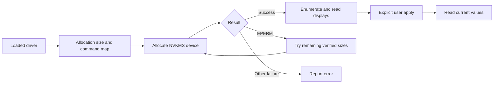

# Digital vibrance

nvcontrol's native backend uses NVIDIA NVKMS ioctls through
`/dev/nvidia-modeset`. CLI, TUI and GUI share the driver-aware backend.
It works independently of compositor color controls; access to the NVIDIA
character devices and a compatible, matching module/userspace stack are required.

## Driver compatibility

| Driver | Native path |
| --- | --- |
| Open 615 | Allocation size and renumbered commands supported |
| Open 610 | Earlier allocation size and command map retained |
| Open 595 | Larger allocation layout retained |
| 600 | Existing 595-family fallback retained; no live hardware result |
| 590 and earlier | Use the separate legacy build described in the driver matrix |

See the [driver matrix](../drivers/nvidia-driver.md) and
[release evidence](../advisories/v0.8.13-release-notes.md) for supported builds
and actual hardware coverage. Do not infer support for an unknown future ABI
from its version number alone.

## Usage

```bash
# Read before changing anything
nvctl display vibrance get
nvctl display vibrance list

# Apply to connected displays
nvctl vibrance 150
nvctl vibe 150

# Apply to the display ID reported by list
nvctl display vibrance set-display 4 150

# Neutral saturation
nvctl vibrance 100
```

Display IDs are discovered from the current system; do not copy another
machine's ID. The current native controller targets one GPU. Setting every
display to 100% is a reset, not a read-only test or restoration of arbitrary
previous values.

| Percentage | Meaning |
| --- | --- |
| 0 | Grayscale |
| 50 | Reduced saturation |
| 100 | Neutral, raw NVKMS value zero |
| 150 | Increased saturation |
| 200 | Maximum, raw NVKMS value 1023 |

The range is 0–200%, mapped to the driver's raw range -1024–1023. Increasing
saturation can help a user's preferred appearance under HDR, but does not
calibrate the display or repair its tone mapping.

## ABI selection



The backing buffer accommodates the known layouts. Only `EPERM` triggers a
retry with another verified allocation size; other errors are returned. A
successful size is cached for the process. Command numbering is selected
separately from the loaded driver. See the [ABI record](../drivers/nvkms-abi-changes.md).

## Permissions and troubleshooting

```bash
nvctl driver diagnose-release
nvctl display vibrance info
ls -l /dev/nvidia-modeset /dev/nvidiactl
cat /sys/module/nvidia/version
```

An allocation failure can indicate an ABI mismatch as well as a permissions
problem. Verify the driver and nvcontrol compatibility before changing device
permissions. Use the distribution's device access policy; membership in `video`
only helps when the device's ownership and mode grant that group access.

DRM KMS is important for the desktop, but an explicit `nvidia_drm.modeset=1`
boot argument is not a prerequisite for native vibrance: the Fedora test guest
passed native vibrance with DRM KMS disabled. Do not change the bootloader solely
because that argument is absent. The effective DRM value, when needed, is in
`/sys/module/nvidia_drm/parameters/modeset`.

The older `nvidia-settings` integration is X11-oriented. Do not assume it will
transparently recover a failed native Wayland operation.

Vibrance can reset after reboot, suspend or a display reconfiguration. Reapply
an explicit preferred value in the user's graphical session. Avoid generic
root sleep hooks that guess the desktop user or overwrite different per-display
preferences.

## Verification and implementation

The GUI provides per-display sliders and presets. For an opted-in development
regression that captures, applies, reads back and restores the original values:

```bash
NVCONTROL_RUN_HARDWARE_TESTS=1 dev/test-hardware.sh --vibrance
```

Do not run this while another process is changing display settings.
Implementation lives in `src/vibrance_native.rs` and `src/nvkms_bindings.rs`;
NVIDIA's tagged headers define the wire ABI. The approach builds on prior NVKMS
work by [nvibrant](https://github.com/Tremeschin/nvibrant).

Related: [HDR](hdr.md), [VRR](vrr-gsync.md),
[local testing](../testing/methodology.md).
