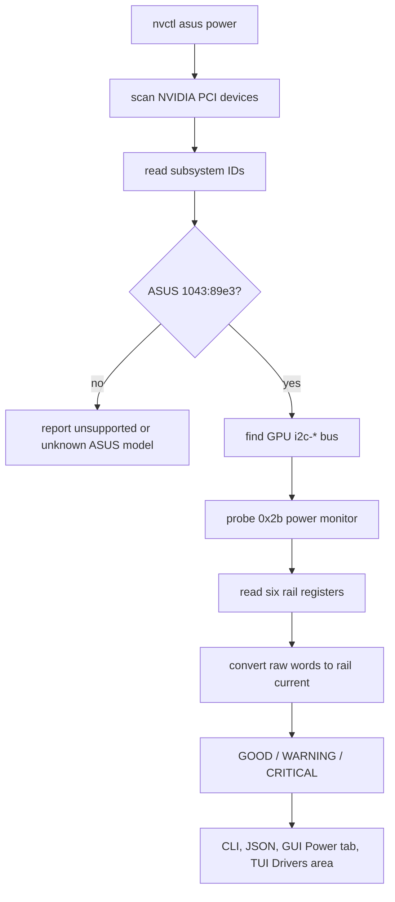
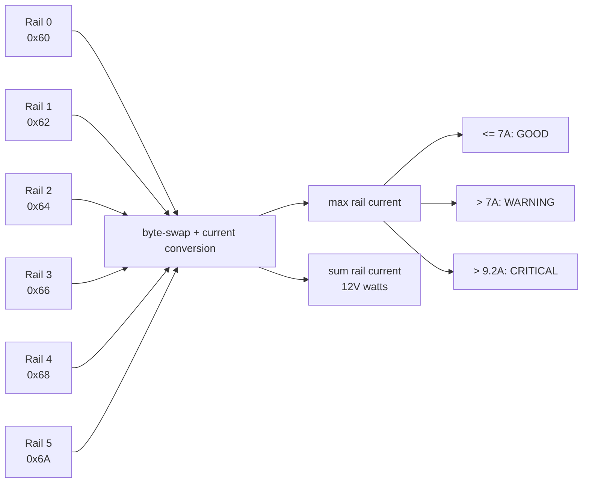

# ASUS ROG Astral RTX 5090 - nvcontrol Support

## Supported GPU

**ASUS ROG Astral GeForce RTX 5090 OC Edition (32GB GDDR7)**

[Product Page](https://rog.asus.com/us/graphics-cards/graphics-cards/rog-astral/rog-astral-rtx5090-o32g-gaming/)

## Unique Features of ASUS ROG Astral

### 1. **Revolutionary 4-Fan Cooling System**
- First-ever **quad-fan** design from ROG
- Vertical airflow channel boosts air pressure by **20%**
- Increased heatsink fin density
- Patented vapor chamber
- Phase-change GPU thermal pad

**nvcontrol Support:**
- Fan curve optimization for 4-fan setup
- Per-fan monitoring (if supported by drivers)
- Aggressive cooling profiles available

### 2. **Factory Overclocked**
- **Boost Clock: 2610 MHz** (OC Mode) vs 2580 MHz reference
- **Default Clock: 2580 MHz** vs 2520 MHz reference
- Higher power limits out of the box

**nvcontrol Detection:**
```rust
// Automatically detected as ASUS Astral variant
RTX 5090 (ASUS ROG Astral)
- Default TDP: 600W (vs 575W reference)
- Max TDP: 630W (vs 600W reference)
- Boost Clock: 2610 MHz
- Safe GPU Offset: +175 MHz (vs +150 MHz reference)
```

### 3. **Aura ARGB Lighting**
- Indirect ARGB lighting
- Customizable colors and effects
- Sync with other ASUS Aura components

**nvcontrol RGB Control (rgb_control.rs):**

**Supported Backends:**
- ✅ OpenRGB (recommended for Linux)
- ✅ asusctl (ASUS laptops/some motherboards)
- ✅ Direct I2C control

**RGB Modes:**
- Static color
- Breathing
- Color cycle
- Rainbow wave
- Temperature reactive (color changes with GPU temp)
- GPU load reactive
- Off (stealth mode)

**Preset Profiles:**
```rust
ROG Red - Classic ROG red static
Cyberpunk Cyan - Breathing cyan
Purple Glow - Breathing purple
Rainbow Wave - Full spectrum cycling
Temp Reactive - Color based on GPU temp:
  < 50°C: Blue/Cyan
  50-60°C: Green
  60-70°C: Yellow
  70-80°C: Orange
  > 80°C: Red
Stealth Mode - LEDs off
```

**Usage Example:**
```bash
# Set static ROG red
nvctl asus aura color FF0000
nvctl asus aura mode static

# Temperature reactive mode
nvctl asus aura temp-reactive --enabled true

# Rainbow mode
nvctl asus aura mode rainbow

# Turn off
nvctl asus aura mode off
```

### 4. **Premium Build Quality**
- Die-cast metal frame
- Metal GPU bracket
- 14-layer PCB
- 3.8-slot design (76mm thick)
- Dimensions: 357.6 x 149.3 x 76 mm

**System Requirements:**
- Check case clearance: 357mm+ GPU length
- Check slot availability: 3.8 slots
- PSU: 1000W recommended
- 12V-2x6 power connector

### 5. **Enhanced Power Delivery**
- Higher quality VRM components
- Better power phases
- More stable under sustained load

**nvcontrol Power Profiles:**

**Stock Profile:**
- GPU Offset: 0 MHz
- Memory Offset: 0 MHz
- Power Limit: 100% (600W)
- Temp Limit: 90°C

**Performance Profile:**
- GPU Offset: +175 MHz
- Memory Offset: +1500 MHz
- Power Limit: 105% (630W)
- Temp Limit: 92°C

**Max Performance Profile:**
- GPU Offset: +210 MHz (1.2x safe offset)
- Memory Offset: +1650 MHz
- Power Limit: 105% (630W)
- Temp Limit: 92°C
- Aggressive fan curve

**Quiet Profile:**
- GPU Offset: -100 MHz
- Memory Offset: -200 MHz
- Power Limit: 85% (510W)
- Temp Limit: 85°C
- Reduced fan speeds

### 6. **DisplayPort 2.1a Support**
- 3x DisplayPort 2.1a
- 1x HDMI 2.1a
- Support for:
  - 4K @ 480Hz
  - 8K @ 165Hz
  - DSC (Display Stream Compression)

Useful for high-refresh multi-monitor setups when the display, cable, compositor, and driver all support the target mode.

## nvcontrol Integration

### Auto-Detection
When nvcontrol detects your GPU, it will automatically identify it as:
```
GPU: ASUS ROG Astral GeForce RTX 5090
Architecture: Blackwell (GB202)
CUDA Cores: 21,760
Memory: 32GB GDDR7 @ 28 Gbps
TDP: 600W (630W max)
Boost Clock: 2610 MHz
Cooling: Quad-Fan Vapor Chamber
RGB: ASUS Aura ARGB
```

### Power Detector+ Implementation

ROG Astral RTX 5090 Power Detector+ is supported and tested in nvcontrol. The implementation is read-only: it discovers the ASUS/NVIDIA PCI device, finds the GPU I2C bus, probes the Astral power monitor at `0x2b`, reads six 12V-2x6 rail registers, computes per-rail current and connector wattage, and reports health without writing to hardware.





Power Detector+ commands:

```bash
nvctl asus detect
nvctl asus power
nvctl asus power --json
nvctl asus power --watch
nvctl asus status
```

### Optimized Features

**1. Cooling Management**
```bash
# Inspect current fan data
nvctl fan info

# Set per-fan speeds as a quick validation step
nvctl fan set 0 35
nvctl fan set 1 35
```

**2. Overclocking**
```bash
# Apply Performance profile
nvctl overclock profile performance

# Custom overclock (ASUS Astral can handle more)
nvctl overclock apply --gpu-offset 200 --memory-offset 1600 --power-limit 105
```

**3. RGB Control**
```bash
# Install OpenRGB first (recommended)
yay -S openrgb

# Set RGB mode
nvctl asus aura color 00FFFF
nvctl asus aura mode breathing

# Temperature reactive
nvctl asus aura temp-reactive --enabled true

# Sync with system
openrgb --mode rainbow --device 0
```

**4. Multi-Monitor + HDR**
```bash
# Example OLED + IPS setup
nvctl monitors apply-preset dual_oled_ips

# OLED: Lower vibrance (300), HDR enabled
# IPS: Higher vibrance (600), SDR

# Per-monitor vibrance tuning
nvctl color vibrance set --value 300 -d 0
nvctl color vibrance set --value 600 -d 1
```

## Setup Checklist for ASUS Astral

### Before Installation:
- [ ] Verify case clearance: **357mm length, 76mm width (3.8 slots)**
- [ ] PSU check: **1000W recommended**
- [ ] Check for 12V-2x6 power connector (or adapter)
- [ ] ReBAR enabled
- [ ] Above 4G Decoding enabled

### After Installation:
- [ ] Install the driver branch recommended by `docs/drivers/nvidia-driver.md`
- [ ] Install OpenRGB for RGB control: `yay -S openrgb`
- [ ] Run system diagnostics: `nvctl doctor`
- [ ] Check detection: `nvctl gpu info`
- [ ] Test ASUS detection: `nvctl asus detect`
- [ ] Test Aura RGB: `nvctl asus aura mode rainbow`
- [ ] Apply an overclock profile if needed: `nvctl overclock profile performance`
- [ ] Setup monitors: `nvctl monitors apply-preset dual_oled_ips`
- [ ] Check DLSS support: `nvctl dlss status`

### Recommended Software:
```bash
# RGB control
yay -S openrgb

# GPU monitoring
yay -S nvtop

# Gaming optimizations
yay -S gamemode lib32-gamemode

# MangoHud for OSD
yay -S mangohud lib32-mangohud
```

## Known Issues & Workarounds

### OpenRGB on Arch
If OpenRGB doesn't detect the GPU immediately:
```bash
# Load i2c modules
sudo modprobe i2c-dev
sudo modprobe i2c-nvidia_gpu

# Add to /etc/modules-load.d/i2c.conf
echo "i2c-dev" | sudo tee /etc/modules-load.d/i2c.conf
echo "i2c-nvidia_gpu" | sudo tee -a /etc/modules-load.d/i2c.conf

# Give user access to i2c
sudo usermod -aG i2c $USER
```

### ASUS Aura on Linux
ASUS Aura Sync doesn't officially support Linux, but:
- **OpenRGB**: Best option, supports ASUS GPUs
- **asusctl**: For ASUS laptops/some motherboards
- **liquidctl**: For some ASUS AIO coolers

### Fan Control
The quad-fan setup should work automatically with:
- nvidia-settings
- nvcontrol fan curves
- CoolBits enabled in X11

## Performance Expectations

### vs Reference RTX 5090:
- **+30 MHz** boost clock out of box
- **+25W** power headroom
- **Better cooling** = sustained higher clocks
- **+175 MHz** safe overclock (vs +150 MHz)

### Gaming Performance:
- 4K Ultra: 100-165 FPS (most AAA titles)
- 1440p Ultra: 240+ FPS (esports titles)
- With DLSS 4 Multi-Frame Gen: Up to 4x FPS boost

### Productivity:
- Blender Cycles: ~3x faster than RTX 4090
- DaVinci Resolve: 8K editing with ease
- AI/ML: Faster training with more VRAM

## Sources

- [ASUS ROG Astral RTX 5090 Official Page](https://rog.asus.com/graphics-cards/graphics-cards/rog-astral/rog-astral-rtx5090-o32g-gaming/)
- [ASUS ROG Astral Specifications](https://rog.asus.com/graphics-cards/graphics-cards/rog-astral/rog-astral-rtx5090-o32g-gaming/spec/)
- [ASUS ROG Astral Review - TechPowerUp](https://www.techpowerup.com/review/asus-geforce-rtx-5090-astral/)
- [OpenRGB ASUS Support](https://openrgb.org/)

---

**The ASUS ROG Astral is ready to rock on your Arch system! 🎮✨**
