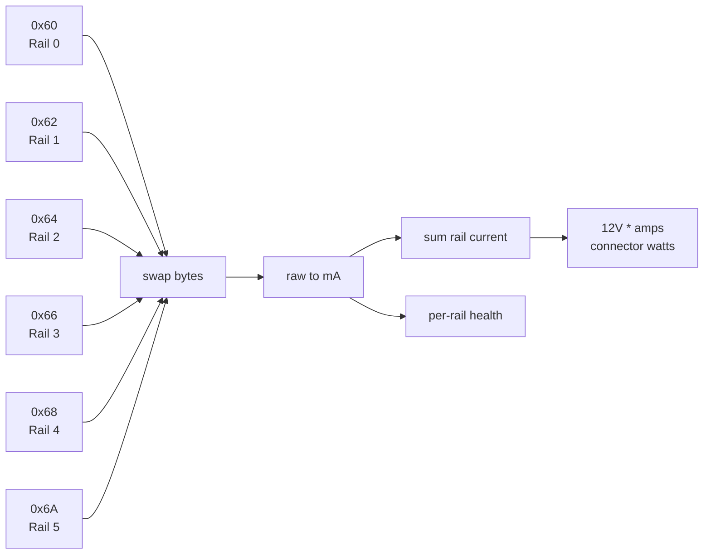
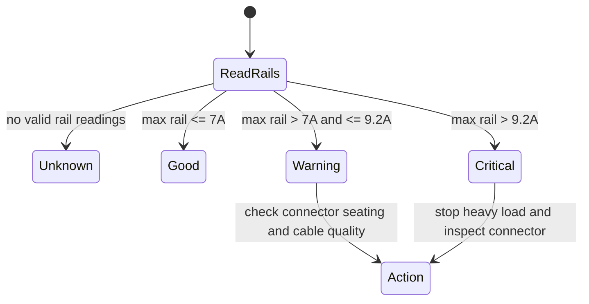
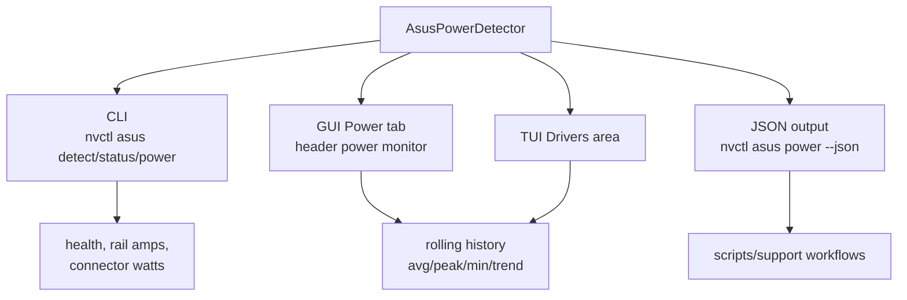

# ASUS Power Detector+ for Linux

nvcontrol includes native support for ASUS Power Detector+, a feature that monitors the 12V-2x6 power connector on high-end ASUS ROG graphics cards.

## What is Power Detector+?

Power Detector+ is an ASUS GPU Tweak III feature that monitors the current flow through each pin of the 12V-2x6 power connector. This helps detect:

- Loose or improperly seated connectors
- Poor-quality power cables
- Overloaded power rails
- Potential melting connector issues (as seen with early 12VHPWR connectors)

## Supported Cards

| Model | Subsystem ID | Status |
|-------|-------------|--------|
| ROG Astral RTX 5090 | 1043:89e3 | Supported and tested through the read-only I2C Power Detector+ path |
| ROG Matrix RTX 5090 | Pending confirmed subsystem ID | Expected family target; not marked supported until IDs and read path are confirmed |

## Usage

### Command Line

```bash
# Detect ASUS ROG GPUs
nvctl asus detect

# Read power rail status
nvctl asus power

# JSON output for scripting
nvctl asus power --json

# Continuous monitoring
nvctl asus power --watch
```

### GUI and TUI

- The GUI keeps a compact Power Monitor+ status in the header and GPU view, with a dedicated **Power** tab for detailed connector-health data.
- The TUI (`nvctl gpu stat`) includes ASUS Power Detector+ details in the Drivers area when a supported card is detected.

## Health Status

The connector health is reported as:

| Status | Color | Meaning |
|--------|-------|---------|
| GOOD | Green | All rails under 7A per pin |
| WARNING | Yellow | One or more rails between 7-9.2A |
| CRITICAL | Red | Rails exceeding 9.2A (danger zone) |
| UNKNOWN | Gray | Unable to read sensor data |

## Technical Details

### How It Works

1. **Detection**: nvcontrol scans for NVIDIA GPUs with ASUS subsystem vendor ID (0x1043)
2. **I2C Bus Discovery**: Identifies the GPU's I2C bus that hosts the power monitoring chip
3. **Sensor Probing**: Reads from I2C address 0x2b (power monitor)
4. **Data Reading**: Reads 6 power rail registers (0x60, 0x62, 0x64, 0x66, 0x68, 0x6A)

```mermaid
flowchart TD
    start["nvctl asus power"] --> detect["scan /sys/bus/pci/devices"]
    detect --> class{"NVIDIA display device?"}
    class -->|no| skip["skip device"]
    class -->|yes| subsystem["read subsystem_vendor\nand subsystem_device"]
    subsystem --> asus{"vendor == 0x1043?"}
    asus -->|no| skip
    asus -->|yes| model["map subsystem ID"]
    model --> astral{"1043:89e3\nROG Astral RTX 5090?"}
    astral -->|no| unknown["ASUS GPU detected\nPower Detector+ not confirmed"]
    astral -->|yes| buses["list GPU i2c-* buses"]
    buses --> probe["probe address 0x2b\nregister 0x60 word read"]
    probe --> found{"power monitor responds?"}
    found -->|no| unavailable["report I2C path unavailable"]
    found -->|yes| read["read rail registers\n0x60, 0x62, 0x64,\n0x66, 0x68, 0x6A"]
    read --> convert["byte-swap word\nconvert raw to mA"]
    convert --> classify["classify GOOD/WARNING/CRITICAL"]
    classify --> output["human output or JSON"]
```

### Register Format

- The reverse-engineered Astral path reads six 16-bit little-endian words from the power monitor at I2C address `0x2b`.
- Rails map to registers `0x60`, `0x62`, `0x64`, `0x66`, `0x68`, and `0x6A`.
- `i2cget` returns little-endian words, so nvcontrol byte-swaps each raw word before applying the current conversion.
- The implemented conversion maps the swapped raw value to milliamps and sums all six rails for 12V connector wattage.



### Health Classification

| Condition | Status | Meaning |
|-----------|--------|---------|
| no valid rail readings | `UNKNOWN` | Sensor path did not produce usable readings |
| max rail current <= 7A | `GOOD` | All rails are inside the normal operating range |
| max rail current > 7A and <= 9.2A | `WARNING` | At least one rail is approaching the per-pin limit |
| max rail current > 9.2A | `CRITICAL` | At least one rail is over the danger threshold |



### Runtime Surfaces



### Safety

This implementation is **READ-ONLY**:
- Uses `i2cget` for safe I2C reads
- Never writes to any I2C registers
- Cannot modify any GPU settings
- Safe to use at any time

## Troubleshooting

### "Read failed" Error

1. Ensure i2c-tools is installed: `pacman -S i2c-tools`
2. Check I2C device permissions
3. Try running with sudo: `sudo nvctl asus power`

### "No ASUS ROG GPU detected"

- Card must have ASUS subsystem vendor ID (0x1043)
- Feature only works on ROG Astral/Matrix series with power monitoring

### "I2C bus not found"

- GPU I2C buses are created by the nvidia driver
- Ensure nvidia driver is loaded: `lsmod | grep nvidia`
- Check for i2c-N directories: `ls /sys/bus/pci/devices/0000:01:00.0/i2c-*`
- On supported Astral hardware, this usually means the driver exposed the GPU but userland does not yet have the required I2C access path

## Validation Notes

- ROG Astral RTX 5090 subsystem `1043:89e3` is the tested supported path.
- The implementation is intentionally read-only and never writes to the power monitor.
- Matrix support should stay unclaimed until subsystem IDs and the same register path are confirmed.
- Support bundles and issue reports should include `nvctl asus detect`, `nvctl asus power --json`, and `nvctl driver diagnose-release` when debugging connector telemetry.

## See Also

- [asus-astral.md](asus-astral.md) - Full ASUS ROG feature list
- [rtx-5090-setup.md](rtx-5090-setup.md) - RTX 50-series setup guide
