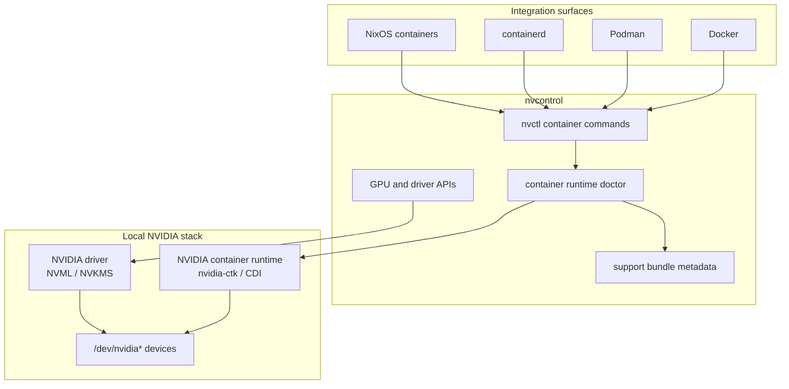

# nvcontrol Integrations

This directory documents nvcontrol's integrations with other tools in the CKTechX ecosystem.

## Experimental Integrations

The following integration remains in `experimental/`:

| Integration | Status | Description |
|-------------|--------|-------------|
| ghostwave | 🧪 Experimental | GPU-accelerated audio denoising |

See [experimental/README.md](../../experimental/README.md) for details on these features.

## Container Runtime

nvcontrol provides native container runtime support for:
- **Docker** with nvidia-container-toolkit
- **Podman** with GPU support
- **containerd** with NVIDIA runtime
- **NixOS** container integration

### Quick Start

```bash
# List GPU containers
nvctl container list

# Launch container with GPU support
nvctl container launch -i nvidia/cuda:latest --gpu all

# Monitor container GPU usage
nvctl container monitor -c my-container
```

## Architecture



## See Also

- [Backend Architecture](../config/backend-architecture.md) - Internal backend design
- [API Reference](../api/reference.md) - nvcontrol Rust API
