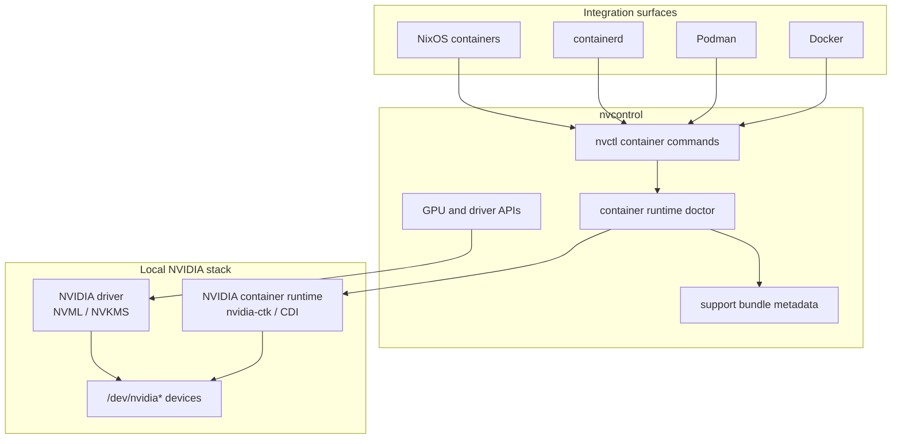

# nvcontrol Integrations

This directory documents nvcontrol's optional desktop, gaming, and container integrations.

## Linux Gaming

- [GeForce NOW Linux](geforce-now.md) - official Flatpak detection and H.265 Vulkan decode readiness
- Gamescope - optional compositor integration exposed by `nvctl gamescope`
- MangoHud and GameMode - optional OSD and game-performance helpers

## Archived proposals

The [ghostwave proposal](../../archive/experimental/docs/GHOSTWAVE.md) is historical
design material, not a shipped integration. Its source is no longer present.

## Container Runtime

nvcontrol provides native container runtime support for:
- **Docker** with nvidia-container-toolkit
- **Podman** with GPU support
- **containerd** with NVIDIA runtime
- **NixOS** container integration

### Quick Start

```bash
# List GPU containers
nvctl container list

# Launch container with GPU support
nvctl container launch -i nvidia/cuda:latest --gpu all

# Monitor container GPU usage
nvctl container monitor -c my-container
```

## Architecture


```mermaid
flowchart TD
    subgraph Integrations["Integration surfaces"]
        Docker["Docker"]
        Podman["Podman"]
        Containerd["containerd"]
        Nix["NixOS containers"]
    end

    subgraph Nvcontrol["nvcontrol"]
        CLI["nvctl container commands"]
        RuntimeDoctor["container runtime doctor"]
        GpuApi["GPU and driver APIs"]
        Support["support bundle metadata"]
    end

    subgraph System["Local NVIDIA stack"]
        Runtime["NVIDIA container runtime\nnvidia-ctk / CDI"]
        Driver["NVIDIA driver\nNVML / NVKMS"]
        Devices["/dev/nvidia* devices"]
    end

    Docker --> CLI
    Podman --> CLI
    Containerd --> CLI
    Nix --> CLI
    CLI --> RuntimeDoctor
    RuntimeDoctor --> Runtime
    RuntimeDoctor --> Support
    GpuApi --> Driver
    Runtime --> Devices
    Driver --> Devices
```

## See Also

- [Backend Architecture](../config/backend-architecture.md) - Internal backend design
- [API Reference](../api/reference.md) - nvcontrol Rust API
- [GeForce NOW Linux](geforce-now.md) - native client readiness and sandbox boundaries
