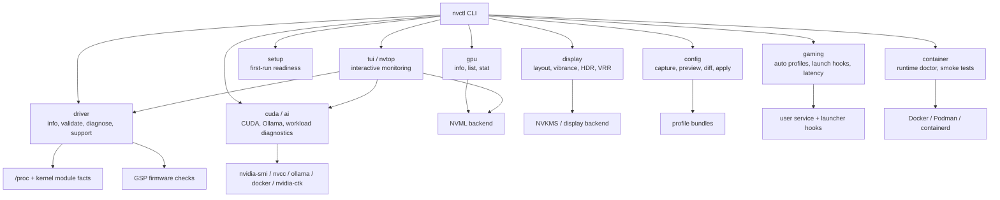
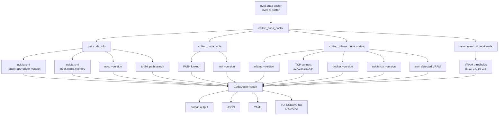
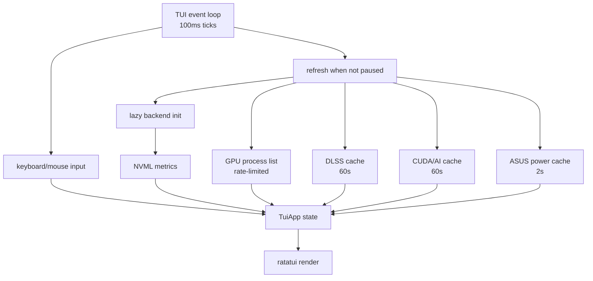
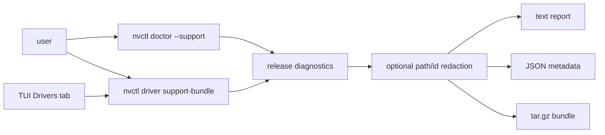

# Architecture

nvcontrol is a Rust desktop/CLI tool around NVIDIA driver state, display controls,
monitoring, gaming workflows, configuration profiles, and support diagnostics. The
project favors direct local inspection with explicit user action for anything that
changes hardware, services, containers, or persistent configuration.

## Command Architecture

## Read/Write Boundary

```mermaid
flowchart LR
    subgraph ReadOnly["Read-only paths"]
        doctor["doctor / support diagnostics"]
        setup["setup check"]
        cuda["cuda doctor / ai workloads"]
        tui_status["TUI status tabs"]
        preview["config preview / diff"]
    end

    subgraph Mutating["Explicit mutating paths"]
        vibrance["vibrance set/reset"]
        oc["overclock apply/reset"]
        fan["fan set/curve apply"]
        power["power limit/profile"]
        service["gaming auto service install/start/stop"]
        profile_apply["config apply"]
    end

    ReadOnly --> guidance["issues, fixes, commands"]
    guidance --> user["user decides"]
    user --> Mutating
```

The release tests should default to the read-only side. Live hardware regressions
must remain explicit and opt-in.

## CUDA/AI Diagnostics Path

## TUI Data Flow

## Support Bundle Flow

Support artifacts should capture enough runtime context to debug driver, GSP, DKMS,
container, setup, and CUDA/AI reports without forcing repeated back-and-forth.

