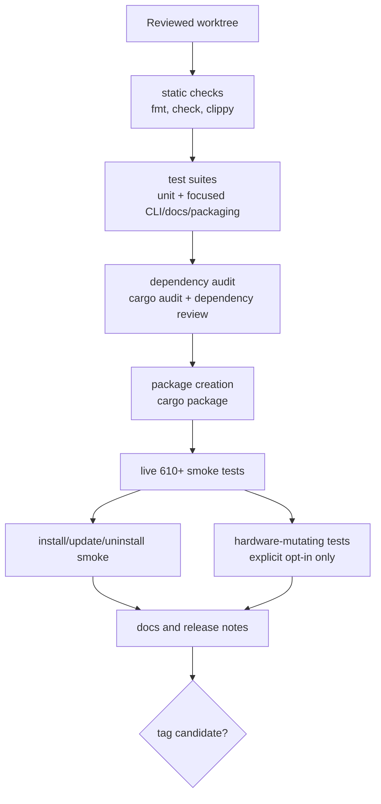
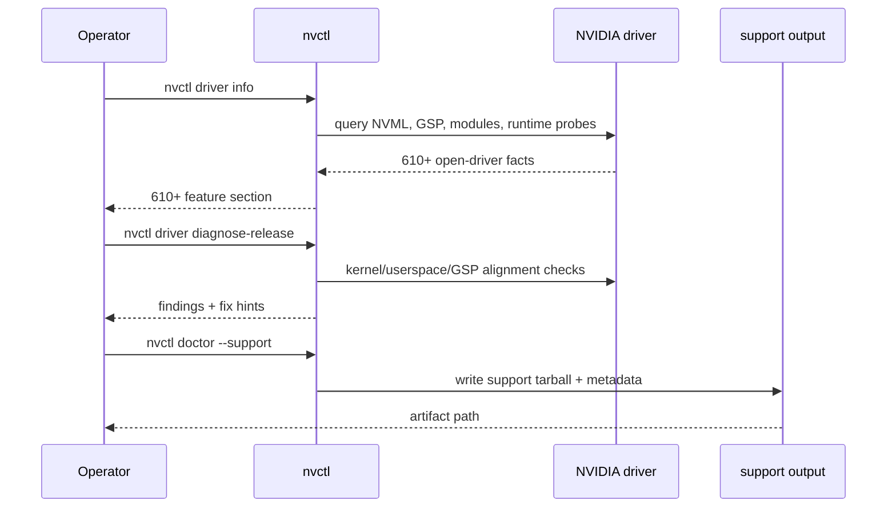
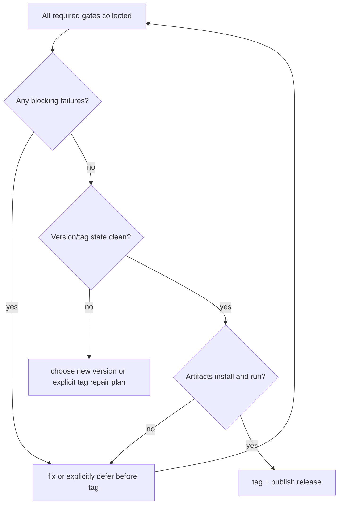

# Release Validation

Release validation is the evidence path for deciding whether a tag is ready. It
separates non-mutating checks, live hardware checks, package/install checks, and
explicitly gated hardware mutation.

## Validation Pipeline

## Gate Matrix

| Gate | Command Or Evidence | Mutates System | Release Meaning |
|------|---------------------|----------------|-----------------|
| Formatting | `cargo fmt --all --check` | No | Rust style is stable |
| Compile | `cargo check --all-targets` | No | All targets typecheck |
| Clippy | `cargo clippy --all-targets -- -D warnings` | No | No accepted warning debt |
| Tests | `cargo test` or focused release suites | No by default | Parser, docs, packaging, regressions pass |
| Audit | `cargo audit` | No | No known RustSec vulnerabilities |
| Package | `cargo package --allow-dirty --no-verify` | No | Crate package can be assembled |
| Driver live smoke | `nvctl driver info`, `diagnose-release`, `validate --driver 610` | Read-only | Actual GPU/driver path is visible |
| Support smoke | `nvctl doctor --support` and support-bundle creation | Writes support artifact | Support artifacts are usable |
| Install smoke | installer, desktop file, icons, completions, services | Yes | Release artifact installs and removes cleanly |
| Vibrance regression | `NVCONTROL_RUN_HARDWARE_TESTS=1 ... --ignored` | Yes | Explicit live display mutation path works |

## Live 610+ Smoke Flow

## Release Decision Flow

## Known Non-Goals For Normal Checks

- Normal CI and local test runs must not change display vibrance.
- Normal diagnostics must not start or stop Ollama, Docker containers, or user
  services.
- Helper probes such as `vulkaninfo` must be isolated from overlay layers when
  possible and treated as optional runtime evidence.

