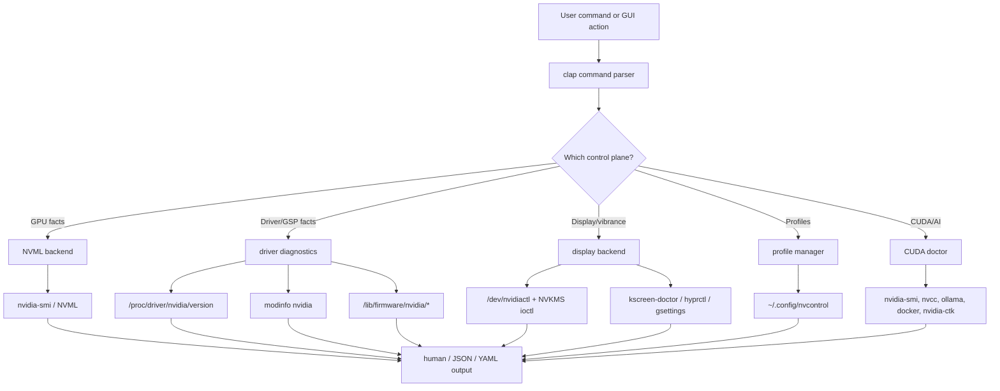
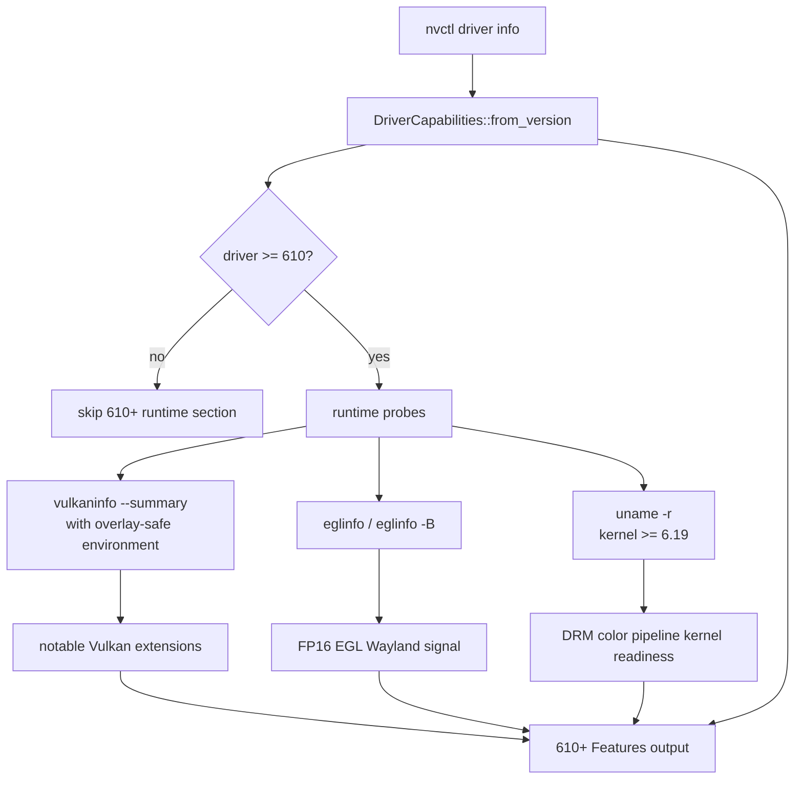
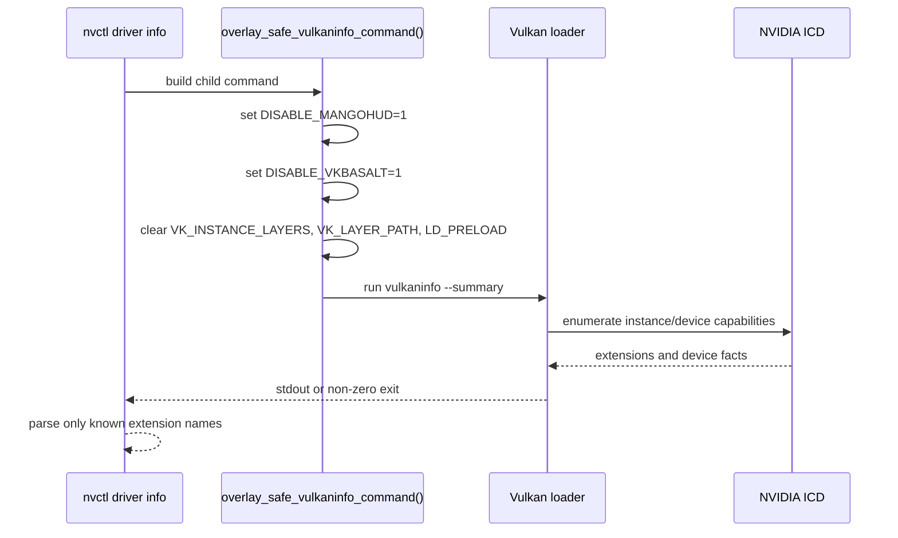
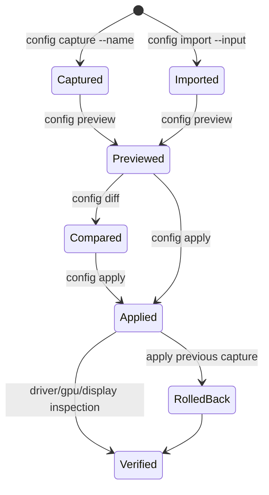
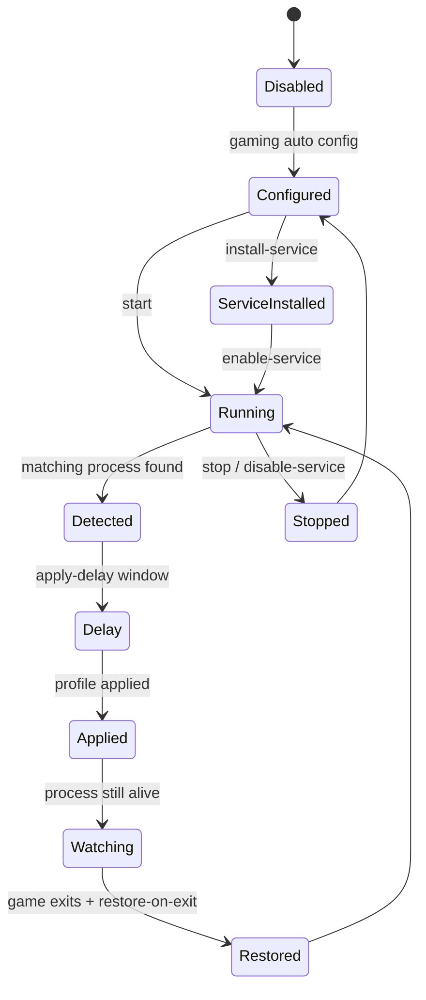
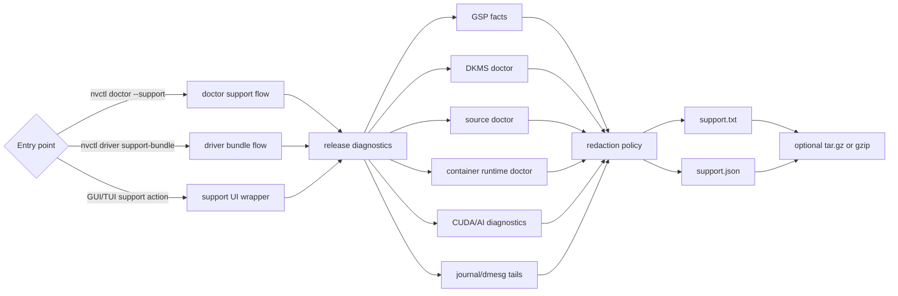
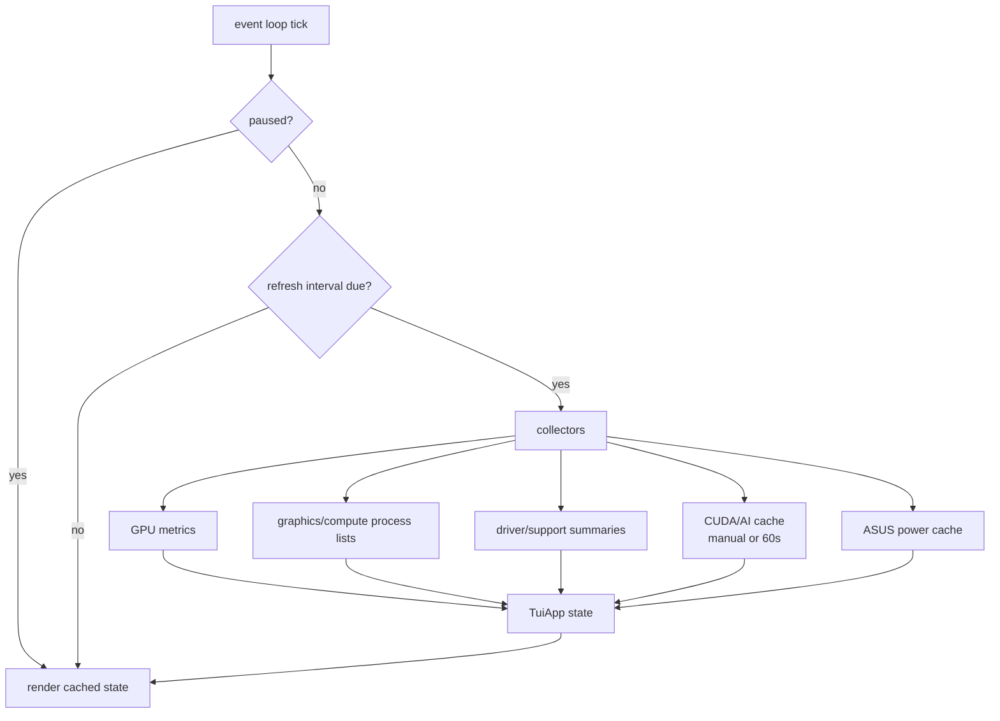

# Runtime Flows

This page documents the runtime flows that matter when reading or debugging
nvcontrol. It is intentionally operational: each diagram maps a user-facing
command or screen to the local system APIs it touches.

## Driver And Display Control Plane

## 610+ Runtime Capability Probe

The 610+ path combines driver-version gates with runtime probes. Runtime probes
must be treated as optional evidence because helper tools can be missing or broken
on otherwise healthy systems.

## Overlay-Safe Vulkan Probe

`vulkaninfo` is a helper process, not trusted core logic. It can load implicit
Vulkan layers such as MangoHud and vkBasalt. nvcontrol runs the probe with those
overlays disabled so diagnostics do not crash inside an overlay layer.

## Profile Bundle Lifecycle

Profile bundles should keep a before/after path. For risky settings, capture the
current system first, preview the target, then apply only after the diff is clear.

## Gaming Auto Profile Lifecycle

This lifecycle is intentionally conservative. The apply delay exists to avoid
changing clocks, fans, or power at the same moment a game is still initializing.

## Support Artifact Pipeline

## TUI Refresh Model

