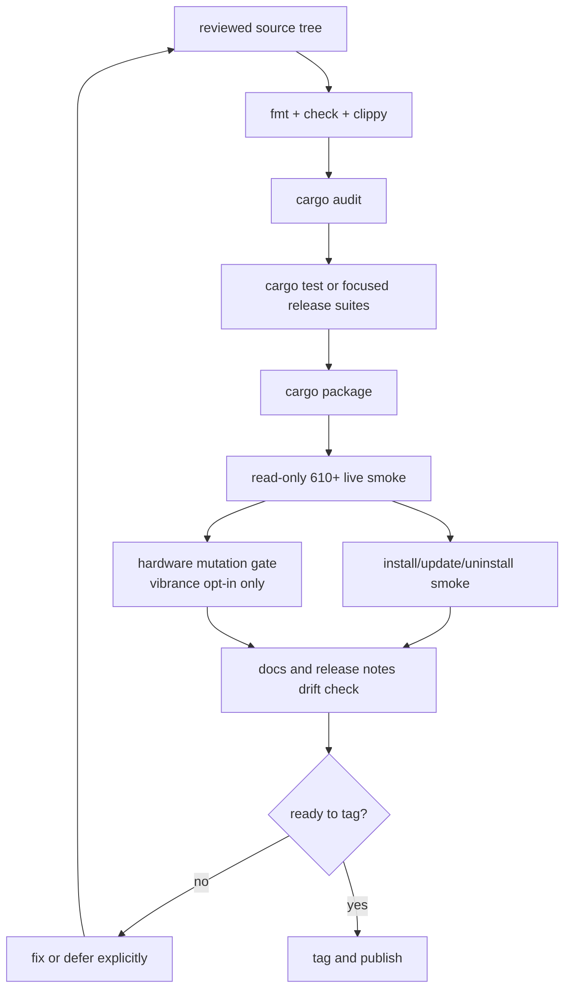

# 0.8.10 Release Checklist

Before shipping `v0.8.10`, verify:



```bash
cargo fmt --all --check
cargo check --all-targets
cargo audit
cargo test

nvctl setup check
nvctl driver diagnose-release
nvctl driver check
nvctl driver validate --driver 610
nvctl driver support-bundle --tarball --redact-paths --redact-ids --log-tail 80 --output ~/.local/state/nvcontrol/support/support.tar.gz
nvctl doctor --support --output ~/.local/state/nvcontrol/support/doctor-support.tar.gz
nvctl companion notify-test
```

Live vibrance mutation is tested separately and must be opted in:

```bash
NVCONTROL_RUN_HARDWARE_TESTS=1 cargo test --test regressions live_vibrance_levels_apply_once -- --ignored
```

## Documentation Checks

- README support workflow is current
- README installer URL matches `https://nv.cktech.sh`
- `docs/drivers/nvidia-driver.md` remains the canonical compatibility matrix
- driver command docs reflect the latest flags
- issue-reporting docs reflect the latest support bundle workflow
- release diagnostics interpretation doc is linked from the docs index

## Expected Artifacts

- support tarball created successfully
- support metadata JSON created or packaged successfully
- no failing tests
- no outstanding cargo audit advisories
- release metadata is `0.8.10` across Cargo, Arch, Fedora, Debian, AppImage, and Flatpak surfaces
- man page and shell completion artifacts reflect current clap commands

See [internals/release-validation.md](internals/release-validation.md) for the detailed gate matrix.
