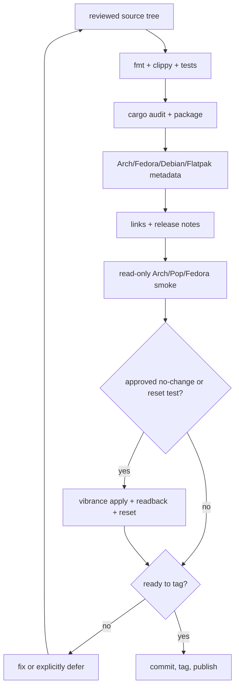

# 0.8.12 Release Checklist

Before tagging `v0.8.12`, verify source, packaging, documentation, and the
hardware-backed 595/610 paths.


```mermaid
flowchart TD
    source["reviewed source tree"] --> rust["fmt + clippy + tests"]
    rust --> audit["cargo audit + package"]
    audit --> packages["Arch/Fedora/Debian/Flatpak metadata"]
    packages --> docs["links + release notes"]
    docs --> live["read-only Arch/Pop/Fedora smoke"]
    live --> mutation{"approved no-change or reset test?"}
    mutation -->|yes| vibrance["vibrance apply + readback + reset"]
    mutation -->|no| decide{"ready to tag?"}
    vibrance --> decide
    decide -->|no| fix["fix or explicitly defer"]
    fix --> source
    decide -->|yes| tag["commit, tag, publish"]
```

## Rust gates

```bash
cargo fmt --all -- --check
cargo clippy --all-features --all-targets --locked -- -D warnings
cargo test --all-features --workspace --locked
cargo audit
cargo package --allow-dirty
```

## Packaging gates

- Cargo, `PKGBUILD`, `.SRCINFO`, release Arch PKGBUILD, Fedora spec, Debian
  changelog, AppImage, and Flatpak all identify 0.8.12.
- Arch, Debian, and Fedora package tests do not contain a failure-masking
  `|| true`.
- `flatpak/cargo-sources.json` matches `Cargo.lock`; the manifest uses the
  Freedesktop 25.08 runtime and offline Cargo mode.
- Desktop files pass `desktop-file-validate` and use one main category.
- The source archive/tag checksum replaces `SKIP` where the publishing channel
  requires immutable release sources.

## Live diagnostics

```bash
nvctl setup check
nvctl driver info
nvctl driver diagnose-release
nvctl vrr status
nvctl display vibrance get
nvctl asus detect
nvctl asus power
```

Required evidence for this release:

- Arch RTX 5090/open 610.57.04: GUI, CLI, TUI, vibrance, VRR, Vulkan/GFN, and
  six-pin Astral telemetry.
- Fedora RTX 3070/open 610.57.04: build/tests, diagnostics, and vibrance no-change
  apply/readback.
- Pop!_OS COSMIC RTX 3070/open 595.84: 595 ABI selection, vibrance no-change
  apply/readback, and preserved-mode COSMIC VRR.

Live mutation tests require explicit approval and must restore the prior value.
Power Monitor+ is read-only and never performs an automatic shutdown or power
limit change.

## Documentation gates

- `CHANGELOG.md` contains `[0.8.12] - 2026-08-16` and matches the shipped diff.
- The docs index links the distro matrix, GeForce NOW integration, Astral API,
  NVIDIA 610 notes, and v0.8.12 release evidence.
- VRR docs distinguish reported capability from inference and do not advertise
  unsupported LFC/adaptive-sync flags.
- Driver docs preserve both the 595 regression target and the validated 610.57.04
  current path.

See [release validation internals](internals/release-validation.md) and
[v0.8.12 release notes](advisories/v0.8.12-release-notes.md).
