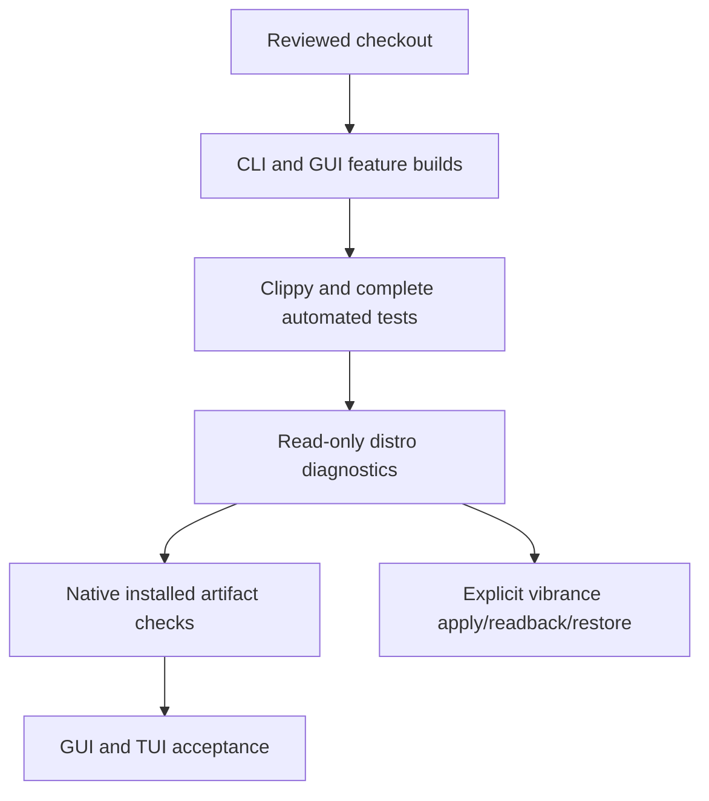

# Testing methodology

Local builds and CI are different evidence sources. Keep the [current CI workflow](ci-workflow.md)
stable while expanding on-demand gates under `dev/`. The [test beds](test-beds.md)
define where native packages and desktop behavior are exercised.

Borrow the useful disciplines from zqlite's release tests: feature/profile
coverage, installed-package consumer checks, and failures propagated to the caller.
Do not copy database-specific tests or claim planned gates already run in CI.

1. Run `dev/test-all.sh` on Arch with the pinned compiler. This covers CLI and GUI
   release builds, no-default-feature library tests, strict formatting/Clippy,
   and all-feature tests. Ignored hardware mutation tests stay excluded.
2. Run the target distro's diagnostic script against the exact installed binary
   using `NVCTL=/usr/bin/nvctl`. Check module/userland alignment and runtime
   capabilities; unavailable optional capabilities are not automatically defects.
3. Build native RPM/Deb artifacts on Fedora/Pop!_OS and verify their installed
   binaries, desktop identity, icon, completions, dependencies and diagnostics.
   A source-tree test does not prove a stale package was rebuilt.
4. Verify GUI scrolling at the normal desktop scale, consistency across tabs,
   live telemetry, dock identity, and TUI keyboard/help behavior. Record manual
   results separately from automated checks.
5. Opt into the named vibrance regression only when exclusive display access is
   available. Capture/readback/restore must succeed; do not reset to an assumed
   default. Ordinary diagnostics must preserve the user's settings.

For each run record commit and dirty state, compiler, OS/kernel, GPU, loaded
module/userland versions, artifact identity, commands, failures and skips. Use
project `.scratch/` for temporary logs, review before sharing, and clean up after
recording evidence. Do not put credentials or private connection details in docs.

## Portable package checks

Build AppImage in an Ubuntu container on a disposable test VM with the pinned
Rust toolchain. The recipe uses Ubuntu's installed archive keyring. The
appimage-builder environment also needs fakeroot, squashfs-tools, desktop/icon
utilities, and `packaging==21.3` because newer Python packaging rejects Debian
package version strings. Keep graphics vendor libraries and Wayland on the host
so a newer Mesa driver does not load an incompatible bundled Wayland library.

Build Flatpak with its declared SDK, Rust extension, and generated offline Cargo
sources. Before publishing a tag, substitute a local source archive only in the
acceptance manifest. Disable the builder cache when replacing that archive;
otherwise a changed local archive can reuse an older build. Install the resulting
bundle into the test user's Flatpak installation.

For each artifact, check CLI startup and native vibrance readback, then launch its
GUI in the existing graphical session with a bounded timeout. Record a timeout
after successful startup as a process-liveness smoke pass, not visual acceptance.
Record the artifact hash alongside results. Do not restart native distro suites
for packaging-only changes. These are local checks; CI workflows are unchanged.

## Future gates

Add debug/release profile coverage and package-consumer jobs after measuring
runtime and runner resources. Keep older-driver ABI tests even when live systems
upgrade; unit coverage is not a live compatibility result. Debian and additional
GPUs remain future targets until a run produces evidence.

Driver-provided Vulkan/Proton fixes need representative workload tests. Extension
presence does not prove in-game Reflex is enabled or that latency improved.
Smooth Motion startup/alt-tab and Vulkan instance lifetime regressions need
specific workloads; repeatedly spawning vulkaninfo does not test a leak within
one process. Cgroup memory partitioning and idle-clock overrides need separate
explicit setup, not automatic changes by diagnostics.

See [release validation](release-validation.md) for release decision gates.
